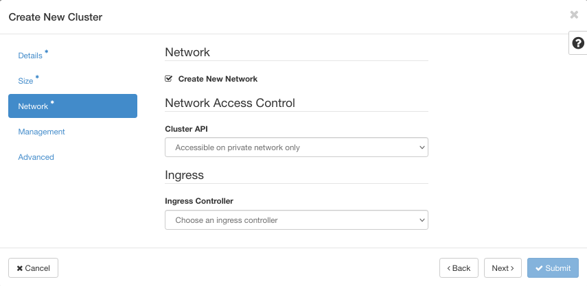

.. Kubernetes documentation master file, created by
   sphinx-quickstart on Sat Dec  4 15:26:27 2021.
   
.. meta::
   :description: Kubernetes cluster documentation for Cloudferro hosting
   :keywords: Cloudferro, OpenStack, Magnum, Kubernetes, cluster, network

How to Create a Kubernetes Cluster Using Cloudferro OpenStack Magnum
====================================================================

Written by `Dusko Savic <https://duskosavic.com>`_.

In this tutorial, you will start with an empty Horizon screen and end up running a full Kubernetes cluster. 

What We Are Going To Cover
--------------------------

 * Creating a new Kubernetes cluster using the default cluster template

 * Visual interpretation of created networks and Kubernetes cluster nodes

Prerequisites
-------------

**Hosting**

You need a Cloudferro hosting account with `Horizon interface <https://horizon.cloudferro.com>`_.

**Private and public keys**

An SSH key-pair created in OpenStack dashboard. To create it, follow this article  `How to create key-pair in OpenStack dashboard? <https://creodias.eu/-/a-9-15>`_

The key pair created in that article is called “sshkey”. You will use it as one of the parameters for creation of the Kubernetes cluster. 

**Project quotas and flavors limits**

Article `Dashboard Overview - Project quotas and flavors limits <https://creodias.eu/-/dashboard-overview-project-quotas-and-flavors-limits>`_ will introduce you to quotas and flavors in OpenStack.  

Cluster Templates
-----------------

Cluster template is a set of parameters which govern the creation of Kubernetes clusters in OpenStack environment. In this tutorial, you shall use the default cluster template to create a new Kubernetes cluster. In production, the preferred approach is to first create your own cluster template and then use it at will.

The main menu command **Container Infra** has two cubcommands, **Clusters** and **Cluter Templates**. Clicking on the latter shows all cluster templates in the system:

Cluster template *k8s-stable-1.21.5-cf1* is the default template, is present in every configuration and is tested against the usual needs of users. You will use this template to generate Kubernetes cluster under OpenStack Magnum. 

Shorthand COE stands for Container Orchestration Engine – software that organizes and controls the running of basic containers. 

Template *New Kubernetes* is a user created template that you build by tweaking or adding new elements into the default template. For instance, template *New Kubernetes* contains keypair *sshkey* that is not present in the default template. 

To see parameters for each cluster template, click on its name in blue, in the **Name** column. Here is what the default template looks like:

It is *fedora-coreos* public virtual machine, using *calico* for its network driver and so on. You can change most of these parameters while creating your own cluster template.  

Creating New Kubernetes Cluster Using the Default Template
----------------------------------------------------------

Step 1 Create New Cluster Screen
--------------------------------

Click on **Container Infra** and then on **Clusters**. 

There are no clusters yet so click on button **+ Create Cluster** on the right side of the screen. 

On the left side and in blue color are the main options -- screens into which you will enter data for the cluster. The three with the asterisks, **Details**, **Size**, and **Network** are mandatory; you must visit them and either enter new values or confirm the offered default values within each screen. When all the values are entered, the **Submit** button in the lower right corner will become active. 

**Cluster Name**

This is your first cluster, name it just *Kubernetes*. 

**Cluster Template**

In this tutorial, there are two templates to choose from. Select *k8s-stable-1.21.5-cf1*, the default one. 

**Availability Zone**

**nova** is the name of the related module in OpenStack and is the only option offered here. 

**Keypair**

Choose *sshkey* from the Prerequisites section. 

This is how the screen looks like when all the data have been entered:

In this step, you have defined main node details, where *node* denotes a Kubernetes node, a part of the cluster that you are forming. 

Click on lower right button **Next** or on option **Size** from the left main menu of the screen to proceed to the next step of defining a Kubernetes cluster.

Step 2 Define Master and Worker Nodes
-------------------------------------

This is the critical part of defining the cluster. If the parameters you enter in this screen are wrong or take too many resources, the creation of cluster will fail. 

**Number of Master Nodes**

Kubernetes cluster has master and worker nodes. In real applications, you would want to have at least two master nodes and, in general, as many as you can. Here, you want to create your first cluster in a new environment so settle for just **1** master node. 

**Flavor of Master Nodes**

Select **eo1.large** for master node flavor. The following table defines all of the possible flavours you can enter here:

**Number of Worker Nodes**

Enter **3**. This is for introductory purposes only, in real life this number can vary from less than ten and up to a few thousands and more. 

**Flavor of Worker Nodes**

Again, choose **eo1.large**. 

**Auto Scaling**

When there is lot of demand for workers' services, the Kubernetes system can scale to using more worker nodes. In this case, you require **3** worker nodes so the options are to subtract one and add **1**, hence, the minimum number of worker nodes is **2** and the maximum number is **4**. 

Here is what the screen **Size** looks like when all the data are entered:

.. image:: size_screen_filled.png

In this step, you have defined the size of your cluster, selecting how many master and worker nodes will there be, as well as their respective sizes. 

To proceed, click on lower right button **Next** or on option **Network** from the left main menu.

Step 3 Defining Network
-----------------------

**Create New Network**

This is the last of mandatory screens and the blue **Submit** button in the lower right corner is now active. (If it is not, use screen button **Back** to fix values in previous screens.)

Submitting it now will create a new network, accessible on private network only.  

Each time you let the system do it, it will create a new network and will not delete the old one, depleting system resources. 

**Cluster API**

If you choose the network to be accessible on the public internet, you will get a warning:

You still can select it but it makes you be more cautious. Kubernetes clusters are made to run on the server as a backup to the main web interface and not to be used as the web interface itself. 

**Ingress Controller**

In Kubernetes parlance, *ingress* is the incoming traffic, i.e. traffic from web for the most part. The opposite, traffic from the network to the internet is called *egress*. 

Ingress controller is a load balancer, it distributes traffic from the outside to a particular node in the cluster. If you are just trying out the system, it is not very likely that you will have one such controller ready, so don't enter data here. 

For the same reason, skip options **Management** and **Advanced** and click on **Submit**. 

OpenStack will start creating the Kubernetes cluster for you. 

Step 4 Forming of the Cluster
-----------------------------

If there is any problem with creation of the cluster, the system will signal it in various ways. You may see a message in the upper right corner, with a red background, like this:

Just repeat the process and in most cases you will proceed to the following screen:

Click on the name of the cluster, *Kubernetes*, and see what it will look like if everything went well. 

There is another way of controlling the proces. Click on **Network** in the main menu and then on **Network Topology**. You will see a real time graphical representation of the network. As soon as the one of the cluster elements is added, it will be shown on screen.

Another way to watch is to show labels:

Orange area represents the newly formed Kubernetes cluster and there will be four nodes, the one ending with **0** is master, the other three are worker nodes. In this particular image, the cluster has an external router, which is connected to the external network.

If you wanted to go to production, you would most likely erase networks that do not support the cluster. 

Here is the state of the instances after the cluster is created:

Node names start with *kubernetes* because that is the name of the cluster. 

Cluster generation usually takes from 10 to 15 minutes. It will be automatically abandoned if duration time is longer than 60 minutes. 

Step 5 Accessing the Results
----------------------------

Here is what OpenStack Magnum created for you as the result of filling in data in those three screens:

 * A new network called Kubernetes, complete with subnet, ready to connect further. 

 * New instances -- virtual machines that serve as nodes. 

 * A new external router.

 * New security groups, and of course

 * A fully functioning Kubernetes cluster on top of all these other elements. 

You selected the number of clusters to be **3** but after a while, the cluster auto-scaled itself to **2** -- there is no traffic to the cluster at all. 

What To Do Next 
---------------

You now have a fully operational Kubernetes cluster. You can install an app into it, say, using ready-made Docker images, then send some traffic to it and so on. You can also use the Kubernetes dashboard and watch the state of the cluster online. 

Another route is to continue using OpenStack Magnum the way it is intended to, that is, to create a cluster template and then use it at will. Cluster templates provide additional flexibility such as 

 * automatic creation of related load balancers, 

 * automatic creation of floating IP addresses and more.

Article `How to Create a Kubernetes Cluster Template Using Cloudferro OpenStack Magnum <../article_02/index.html>`_ will provide more information. 

.. toctree::
   :maxdepth: 3
   :caption: Contents:

    
