.. Kubernetes documentation master file, created by
   sphinx-quickstart on Sat Dec  4 15:26:27 2021.

.. meta::
   :description: How to create a Kubernetes cluster template 
   :keywords: cluster template, Cloudferro, OpenStack, Magnum, Kubernetes, cluster, network
   
How to Create a Kubernetes Cluster Template Using Cloudferro OpenStack Magnum
=============================================================================

Written by `Dusko Savic <https://duskosavic.com>`_.

OpenStack Magnum on Cloudferro hosting comes with default template cluster. It is possible to create clusters manually but the preferred way is to create a new cluster template and then use it as needed. 

What We Are Going To Cover
--------------------------

 * Creating a new Kubernetes cluster template 

 * Using labels to change the behaviour of Magnum

 * Creating a new Kubernetes cluster using that template

Prerequisites
-------------

**Hosting**

You need a Cloudferro hosting account with `Horizon interface <https://horizon.cloudferro.com>`_.

**Private and public keys**

An SSH key-pair created in OpenStack dashboard. To create it, follow this article  `How to create key-pair in OpenStack dashboard? <https://creodias.eu/-/a-9-15>`_. You will have created keypair called “sshkey” and you will be able to use it for this tutorial as well. 

**Project quotas and flavors limits**

The article `Dashboard Overview - Project quotas and flavors limits <https://creodias.eu/-/dashboard-overview-project-quotas-and-flavors-limits>`_ gives basic definitions of quotas and flavors in OpenStack. (Briefly, a *quota* is how many, say, instances you can have in total, while *flavor* is how large do you want one instance to be.)

**Networks for Kubernetes Cluster**

If you want to use an existing network and base a Kubernetes cluster on it, the article, `How to create a network with router in Horizon Dashboard?  <https://cloudferro.com/en/faq/?id=46140249>`_ will show you how to do it. 

**Create New Kubernets Cluster From a Cluster Template**

Once you define a new custom template in this tutorial, you can generate a new Kubernetes cluster in the same way way as is described in article `How to Create a Kubernetes Cluster Using Cloudferro OpenStack Magnum <../article_01/index.html>`_ .

Step 1 **Create Cluster Template** -- option **Info**
-----------------------------------------------------

Clicking on **Container Infra** and then on **Cluster Templates** shows the existing templates:

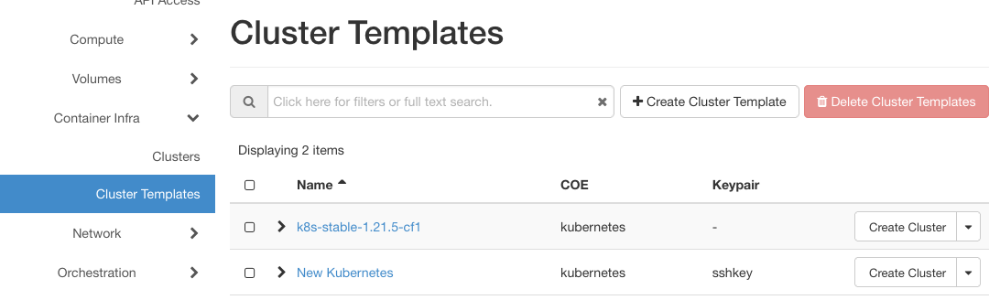

*k8s-stable-1.21.5-cf1* is the default template while *New Kubernetes* is a user made template. Once you finish your template, it will show in this screen as well. 

Click on **+ Create Cluster Template** to start the process:

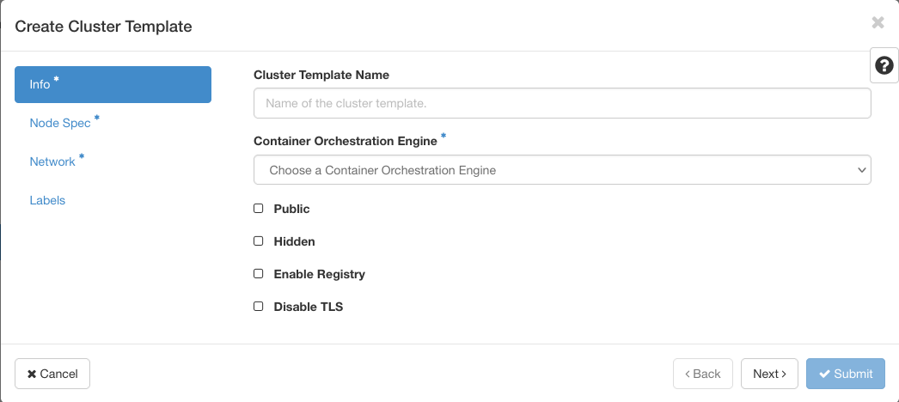

An asterisk near the name of the option denote that it is mandatory to visit that screen or field. 

**Cluster Template Name**

Make it reflect the goal of the setup. For this occasion, let us pretend we are making a cluster for selling books online and call it *Bookshelf*.

**Container Orchestration Engine**

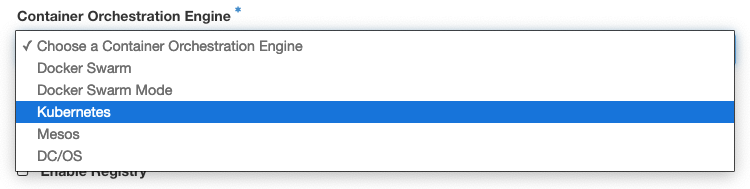

Select Kubernetes because it is by far the most popular container platform today.

**Public**

Whether the cluster will be accessible by other users under Magnum. Default is not public, which means that only the admin, owner or users in the same tenancy will have access to the cluster. 

**Hidden**

Hidden, but can still be referenced.

**Enable Registry**

This is about Docker registry. The default is to use the public Docker registry. If this field is turned off, Magnum will substitute its own local registry in the cluster. 

**Disable TLS**

TLS stands for *Transport Layer Security*. It is enabled by default, which raises the level of security in the system (needs a key and signed interface to access the Kubernetes cluster). In development phase, can be turned off. 

Here is what the **Info** window looks like with all the data entered:

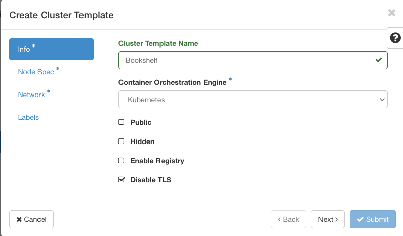

Click on lower right button **Next** or on option **Node Spec** from the left main menu of the screen to proceed to the next step of defining a Kubernetes cluster template.

Step 2 Node Specification
-------------------------

In this step you will set up the number of nodes as well as their flavors. 

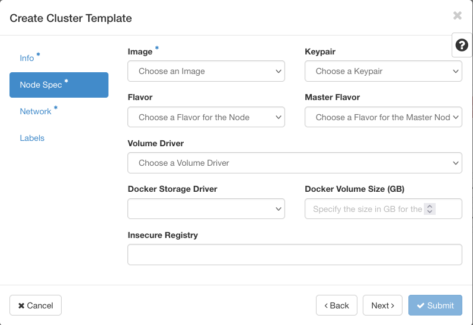

Click on question mark with black background to see the explanation and definitions of the fields:

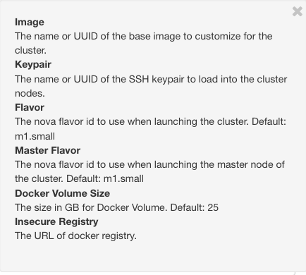

**Image**

Operating system that the nodes in cluster will run on. 

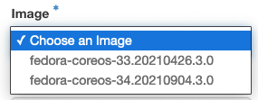

There are two options, versions 33 and 34 of *fedora-coreos* operating system, from 2020 and the first half of 2021. Choose v34.

**Keypair**

The SSH keys you got from the article mentioned in the Prerequisites section. The name is *sshkeys*. 

**Flavor**

The size of worker nodes (previously known as *minions*). There are 23 options to choose from. In the menu, the options are:

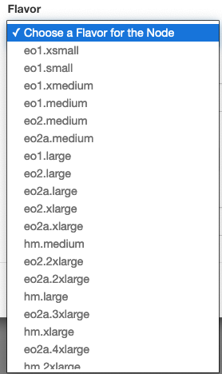

With an OpenStack CLI command 

**openstack flavor list**

you get definition of resources that will be available with each flavor:

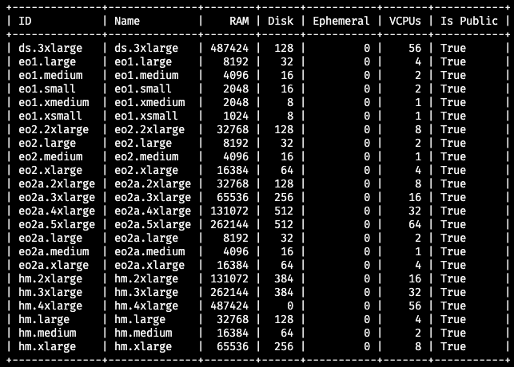

Select **eo1.large** for master node flavor. That is a comfortable size of 4 central processors, 8 GB or RAM memory and 32 GB of disk storage. 

Not every combination of parameters will result in a Kubernetes cluster. Fedora distributions require at least 10 GB in size while a "small" flavor such as *eo1.xsmall* will have only 8 GB of storage, therefore, will result in an error message.

**Master Flavor**

The same applies to master flavor -- the size of Master node(s). To be on the safe side,  choose **eo1.large** again. 

Flavors and the number of VCPUs are not the only factors that decide whether the cluster will be installed or not. Each cluster will claim its own resources that subtract from the total quota of resources. In particular, Magnum will reserve 11 security group rules for worker nodes and 18 rules for each master node. Here is what the consumption of security rules and groups looks like after the *Kubernetes* cluster was formed in the Prerequisites article:

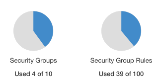

**Volume Driver**

There is only one option to choose from and it is **Cinder**. With Cinder, the end user may use storage without knowing where the actual hardware for storage is, or on what type of device. 

**Docker Storage Driver**

Offers two drivers -- **Device Mapper** and **Overlay**. **Device Mapper** is the default. 

**Docker Volume Size (GB)**

Default value is 25 GB for Docker images. 

**Insecure Registry**

The URL of alternative Docker registry from which you intend to download Docker images. 

This is what the **Node Spec** screen looks like with all the values entered in:

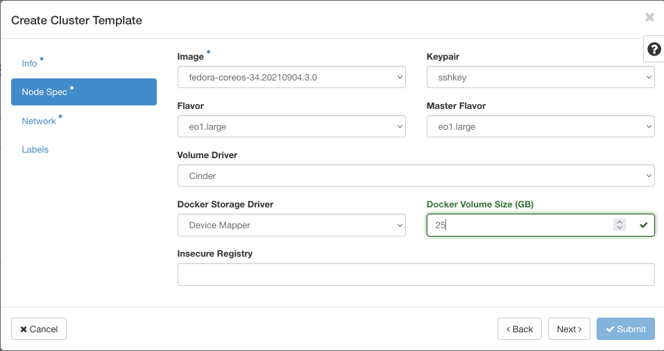

In this step, you have defined flavors and Docker parameters for nodes in a Kubernetes cluster. The next step is to define the network to connect the nodes into one whole.

Step 3 Defining Network
-----------------------

In the **Network** window, you define properties of the underlying network for the cluster. 

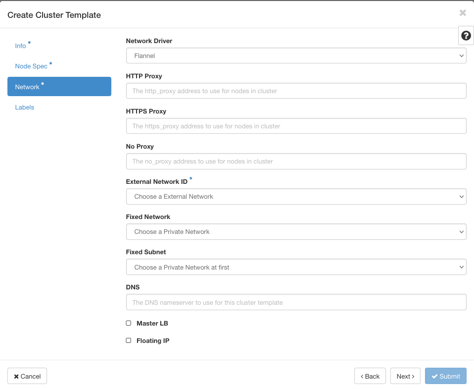

Click on the question mark in the upper right corner to remind you of basic default values in this screen. 

**Network Driver**

Choose between *Flannel* and *Calico*. The default cluster template uses *Calico*, so that is the recommendation. 

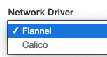

**HTTP Proxy**, **HTTPS Proxy**, **No Proxy**

Leave these field empty unless you already have such proxies settled in the system.

**External Network ID**

A mandatory field, with only one option, *external*, so choose that. 

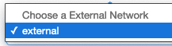

**Fixed Network**

If you select a network here, it will, obviously, be used to create a cluster later on. If not, you will be able to define the network later in the process of creating a cluster from a cluster template.

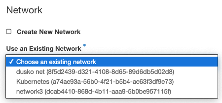

The default value of this field is 10.0.0.0/24. 

Again, the article mentioned in the Prerequisites section will show how to properly define a network. 

**Fixed Subnet**

A network selected in the above field **Fixed Network** must have a subnet defined. This field is empty unless you define a concrete network in field **Fixed Network**, like this:

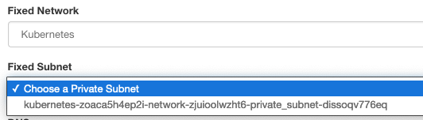

**DNS**

Nameserver to use for the cluster template. The default is 8.8.8.8, but a similar value of 8.8.4.4 is often encountered as well.

**Master LB**

Attach LoadBalancer to the main node or not. Default is False. 

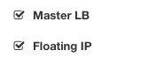

**Floating IP**

To create a floating IP for the cluster or not. Default is to create it automatically.

Here is the **Network** screen filled in for this example:

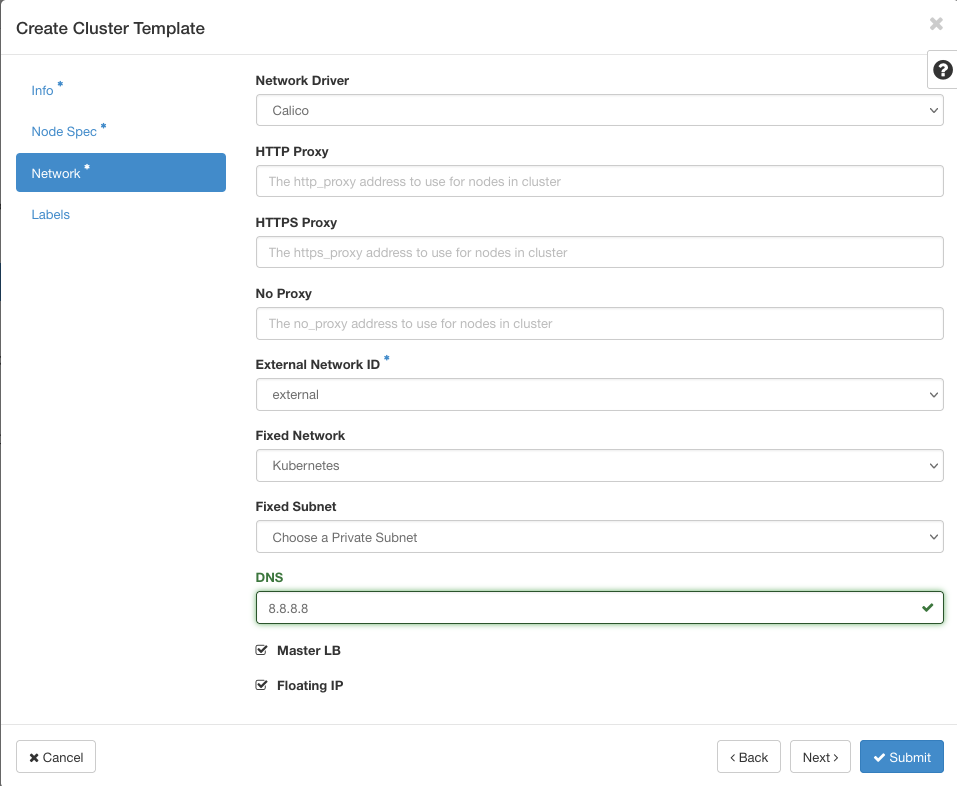

Step 4 Define Labels
--------------------

Labels are variables that can define or redefine the actions of Magnum. 

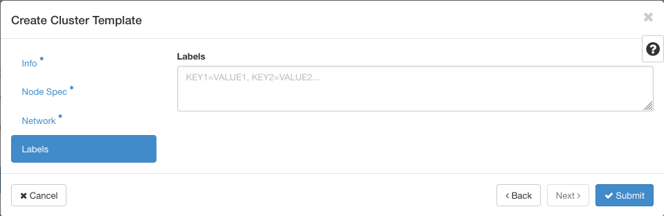

Many labels are predefined in system. Here is what they look like for the default template, *k8s-stable-1.21.5-cf1*:

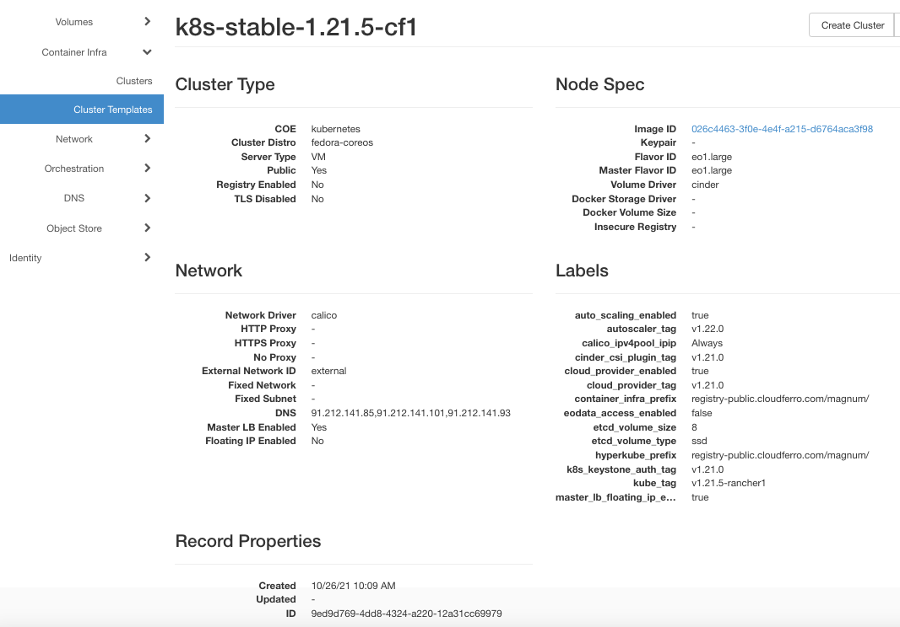

Cloudferro hosting specializes in spatial and satellite data and there is a special label if you want to connect to that type of service: *eodata_access_enabled*. However, further discussion of such possibilities is out of scope of this article. 

If you want your new template to have identical labels as the default template, enter the following into the **Labels** field:

auto_scaling_enabled=true,autoscaler_tag=v1.22.0,calico_ipv4pool_ipip=Always,cinder_csi_plugin_tag=v1.21.0, cloud_provider_enabled=true,
cloud_provider_tag=v1.21.0, container_infra_prefix=registry-public.cloudferro.com/magnum/,
eodata_access_enabled=false, etcd_volume_size=8,etcd_volume_type=ssd,
hyperkube_prefix=registry-public.cloudferro.com/magnum/,
k8s_keystone_auth_tag=v1.21.0,kube_tag=v1.21.5-rancher1,
master_lb_floating_ip_enabled=true

Your new cluster template is going to have the following parameters;

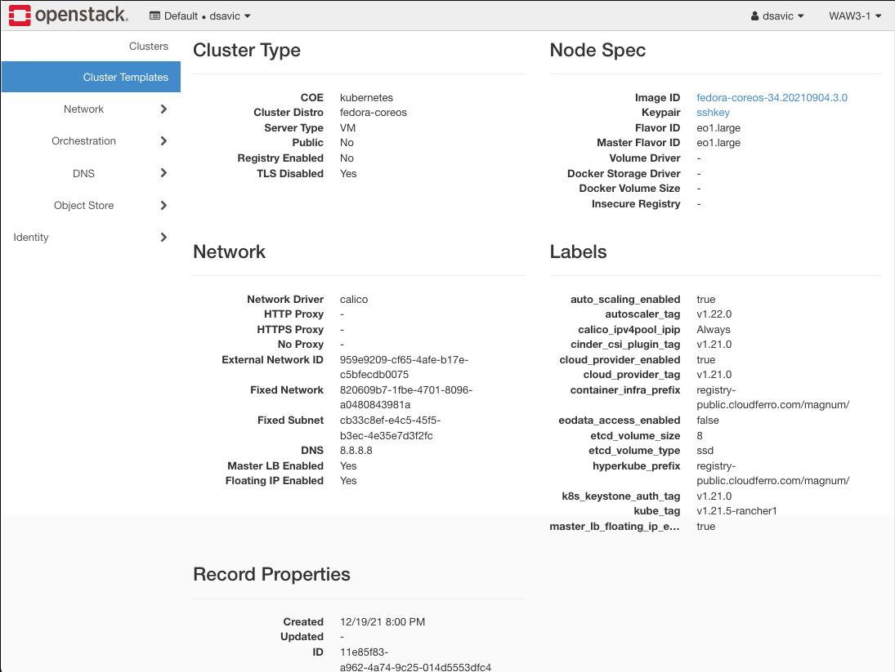

Click on button **Submit** in the lower right corner to create the cluster template.

Step 5 Creating the Cluster Template
------------------------------------

In most cases, you will instantly see a new template, called *Bookshelf*, in the list:

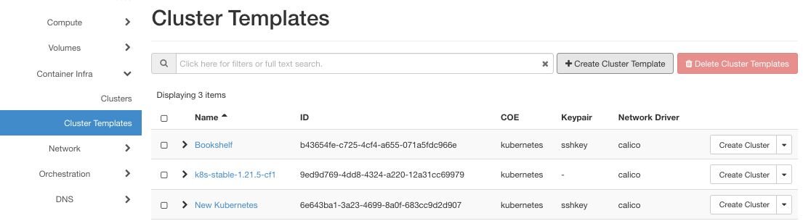

What To Do Next 
---------------

Once a new template is finished, you can follow the article `How to Create a Kubernetes Cluster Using Cloudferro OpenStack Magnum <../article_01/index.html>`_ and use it to create a new Kubernetes cluster. 

