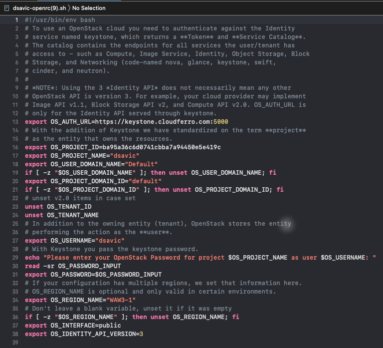

.. Kubernetes documentation master file, created by
   sphinx-quickstart on Sat Dec  4 15:26:27 2021.

.. meta::
   :description: Install OpenStack and Magnum clients for command line interface under  Cloudferro Horizon 
   :keywords: cluster template, Cloudferro, OpenStack, Magnum, Kubernetes, cluster, network, installation, CLI, Kubernetes cluster

How To Install OpenStack and Magnum Clients for Command Line Interface to Cloudferro Horizon 
===================================================================================================

Written by `Dusko Savic <https://duskosavic.com>`_.

How To Use Issue Commands to the OpenStack and Magnum Servers
-------------------------------------------------------------

There are three ways of working with Kubernetes clusters within Openstack Magnum and Horizon modules:

**Horizon Commands**

You issue Horizon commands using mouse and keyboard, through predefined screen wizards. It is the easiest way to start but not the most productive in the long run.

**Command Line Interface (CLI)**

CLI commands are issued from desktop computer or server in the cloud. This approach allows you to save commands as text and repeat them afterwards. This is the preferred way for professionals.

**HTTPS Requests to the Magnum Server**

Both the Horizon and the CLI use HTTPS requests internally and in an interactive manner. You can, however, write your own software to automate and/or change the state of the server, in real time. 

What We Are Going To Cover
--------------------------

 * How to install the CLI -- OpenStack and Magnum clients

 * How to connect the CLI to the Horizon server

 * Basic examples of using OpenStack and Magnum clients

Prerequisites
-------------

No. 1 **Hosting**

You need a Cloudferro hosting account with `Horizon interface <https://horizon.cloudferro.com>`_.

.. note::

   OpenStack is written in Python so you need to first install a Python working environment and then install the OpenStack clients. Officially, OpenStack runs only on Python 2.7 but you will most likely only be able to install a version 3.x of Python. During the installation, adjust accordingly the numbers of Python versions mentioned in the documentation.

No. 2 **Installation of OpenStack CLI on Ubuntu 18.04 Server**

The article `How to install OpenStackClient (Linux)? <https://creodias.eu/-/how-to-install-openstackclient-linux-?inheritRedirect=true&redirect=%2Ffaq-openstack-cli>`_ shows how to install OpenStack client on Ubuntu server. That Ubuntu may be the desktop operating system, a virtual machine on some other operating system, or an Ubuntu server in the cloud. 

Installation on Mac OS will be similar to the installation on Ubuntu.

No. 3 **Installation of OpenStack CLI on Windows** 

The article `How to install OpenStackClient (Windows)? GitBash/Cygwin <https://creodias.eu/-/how-to-install-openstackclient-windows-gitbash-cygwin?inheritRedirect=true&redirect=%2Ffaq-openstack-cli>`_ shows the installation on Windows.

No. 4 **General Instructions for Installation of OpenStack Clients**

There are various ways of installing Python and the required clients. For instance, on MacOS, you can install the clients using Python PIP or install them natively, using *homebrew*.

The article `Install the OpenStack command-line clients <https://docs.openstack.org/newton/user-guide/common/cli-install-openstack-command-line-clients.html>`_ will give a systematic introduction to installation of OpenStack family of clients on various operating systems. 

Once installed, the CLI commands will be identical across various platforms and operating systems. 

No. 5 **Create Python 3 Virtual Environment**

Create Python 3 virtual environment using the **venv** module with this command:

.. code::

   python3 -m venv py3-sphinx

Now “activate” the environment, which is here called *py3-sphinx*:

.. code::

   source py3-sphinx/bin/activate

The command prompt in terminal will start out with the name of the environment: 

.. code::

   (py3-sphinx) $

On MacOS, under which these documents have been written, the command prompt might include the name of the user and the directory, for example:

.. code::

   (py3-sphinx) duskosavic@Duskos-iMac CloudFerroDocs %

Step 1 Install the CLI for Kubernetes on OpenStack Magnum
---------------------------------------------------------

In this step, you are going to install clients for commands **openstack** and **coe**, from modules OpenStack and Magnum, respectively. 

Follow the Prerequisites Nos. 2, 3 or 4 to install the main client for OpenStack. Its name is *python-openstackclient* and the installation described in those will typically contain a command such as 

.. code::

   pip install python-openstackclient

At the end of installation from either of the prerequisite articles, install Magnum client by issuing this command:

.. code::

   pip install python-magnumclient

Step 2 Connect OpenStack and Magnum Clients to Horizon Cloud
------------------------------------------------------------

After installation, clients for OpenStack and Magnum are ready to execute on the computer or server. The next step is **connecting** them to server, through a series of HTTPS calls. First you 

 * download a token from server, then 

 * install it on the server or computer where the clients are and then

 * use the token in each and every API call to the cloud. 

**Download OpenStack RC File**

From the main menu in Horizon interface execute command **API Access** and see a  screen similar to this:

Some links will have additional parameters in their parameter lists, however, these are erased for security from the image above. 

The clients will use the link called *Identity*

.. code::

   https://keystone.cloudferro.com:5000 

for authorization of access.

Click on button **Download OpenStack RC File** on the right side of the window, then click on menu option **OpenStack RC File** and download the RC file. 

The name of the file to download starts with your username for the Horizon cloud and ends up with *openrc.sh*. In this case, it will be *dsavic-openrc.sh*.

When downloaded, the file will look like this:

Its purpose is to install system variables which the OpenStack and Magnum clients will use to connect to the cloud. The lines that start with **export** will store a value into a system variable. 

Taken together, the information in this file will be sufficient for clients to connect to the cloud. 

**Execute the RC file with a system app**

On Linux systems, files that have an extension *.sh* are executable files and the first line in the file directs with which application to execute such file. In this case, the first line points to *bash*, which is a standard shell script under Ubuntu.

Using *bash*, the command to execute a script on Ubuntu is **source**:

.. code::

   source ./dsavic-openrc.sh

Other operating systems will have their own versions of the *bash*. Under MacOS Big Sur, for example, you would use *zsh*, like this:

.. code::

   zsh ./dsavic-openrc.sh

You have to execute this file at the start of every terminal session and it will last until the terminal window is closed. When asked, enter your Horizon password:

Once the password is entered, the password will be exported to a system variable, and the clients will be set up.

.. note::

   Password will *not* be shown, for security reasons. 

Step 3 How to Use the OpenStack Client
--------------------------------------

In this step, you are going to start using the OpenStack client you have installed and connected to the cloud. 

There are two ways of using the OpenStackClient. If you enter the word **openstack** at the command prompt of the terminal, you will enter the special command line interface, like this:

The benefit would be that you do not have to type **openstack** keyword for every command.

Type **quit** to leave the **openstack** internal command line prompt. 

The preferred way, however, is typing the keyword **openstack**, followed by parameters and running from terminal command line.

Openstack commands may have dozens of parameters so it is better to compose the command in an independent text editor and then copy and paste it into the terminal. 

The Help Command
----------------

To learn about the available commands and their parameters, type **--help** after the command. If applied to the keyword **openstack** itself, it will write out a very long list of commands, which may come useful as an orientation. It may start out like this:

This is how it ends:

The colon in the last line means that the output is in **vi** (or **vim**) editor. To leave it, type letter **q** and press Enter on the keyboard.

Prerequisites No. 3 and 4 lead to official OpenStack user documentation. 

Here is what happens when you enter a wrong parameter, say, *networks* instead of *network*:

.. code:: 

   openstack networks list
 

You get a list of commands similar to what you just typed. 

To list networks available in the system, use a singular version of the command: 

.. code::

   openstack network list

Step 4 How to Use the Magnum Client
-----------------------------------

OpensStack command for the server is **openstack** but for Magnum, the command is not **magnum** as one would expect, but **coe**, for *container orchestration engine*. Therefore, the commands for clusters will always start with **openstack coe**.

See cluster commands by entering 

.. code::

   openstack coe 

into the command line:

You can see the existing clusters using the following command: 

.. code::

   openstack coe cluster list

This is more or less the same information that you can get from the Horizon interface:

after clicking on **Container Infra** => **Clusters**.

Prerequisite No. 5 offers more technical info about the Magnum client.

What To Do Next 
---------------

In this tutorial you have 

 * installed the *OpenStack* and *Magnum* clients

 * connected them to the server, then used

 * **openstack** command to access the server in general and 

 * **coe** to access the clusters in particular.

The article `How To Use Command Line Interface for Kubernetes Clusters On Cloudferro OpenStack Magnum  <../article_04/index.html>`_ explains 

 * the advantages of using the CLI instead of Horizon interface, showing

 * how to create a cluster template as well as

 * how to create a new cluster

all via the CLI.

