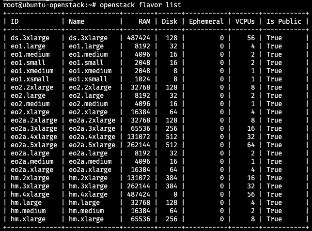
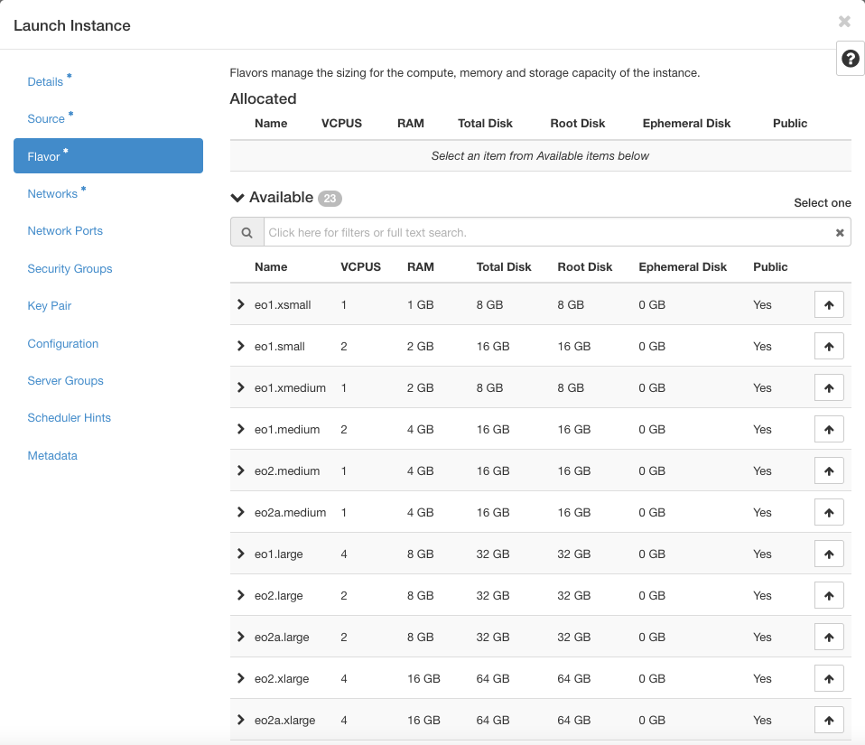
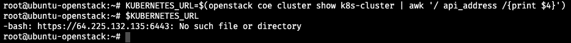
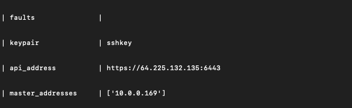
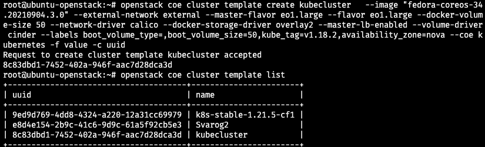
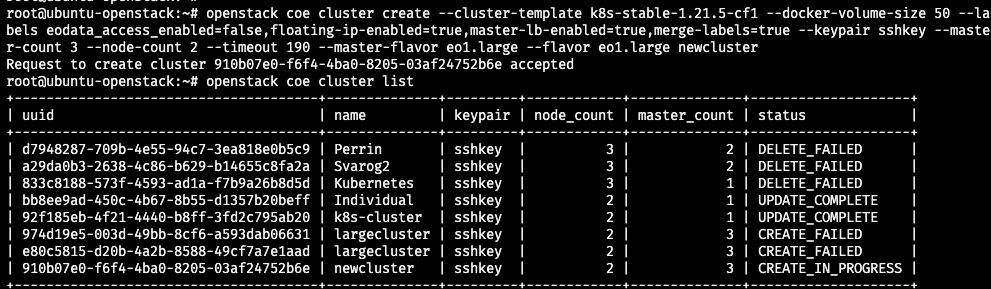
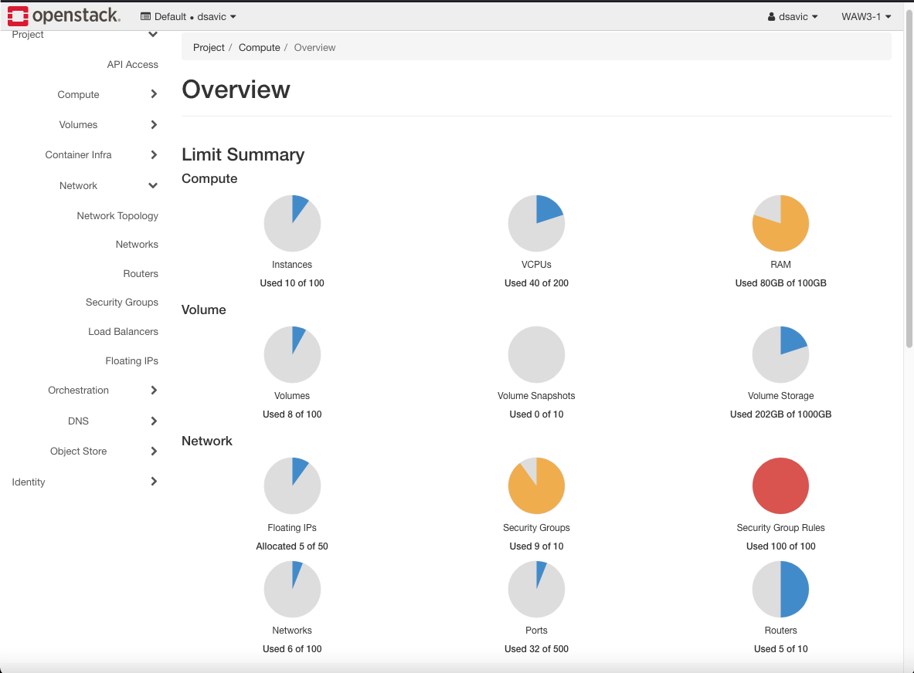
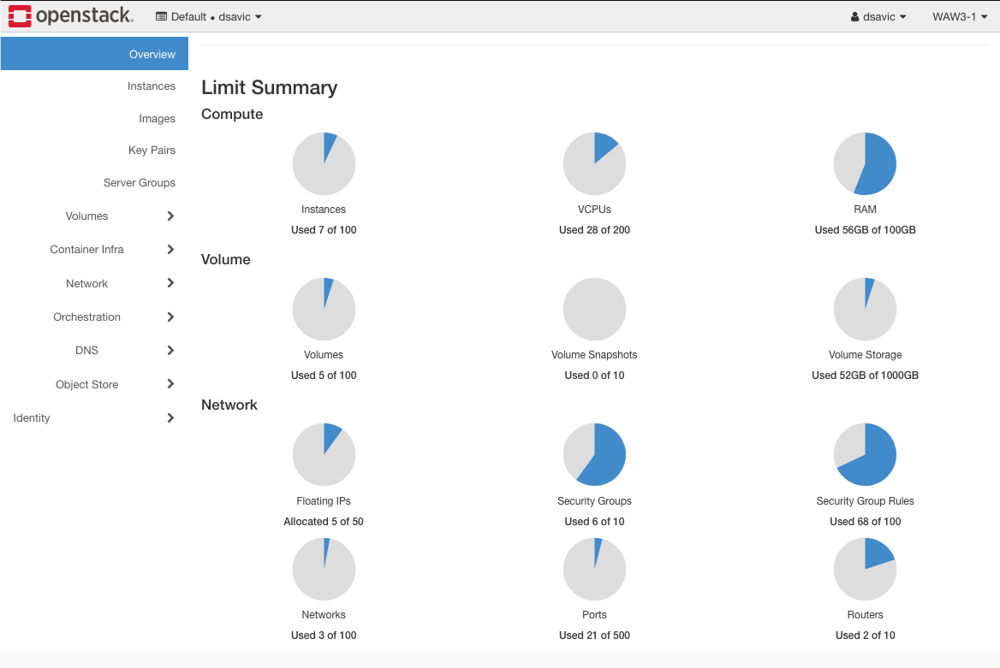

.. Kubernetes documentation master file, created by
   sphinx-quickstart on Sat Dec  4 15:26:27 2021.

.. meta::
   :description: How to use command line interface for Kubernetes clusterson on OpenStack Magnum 
   :keywords: cluster template, Cloudferro, OpenStack, Magnum, Kubernetes, cluster, network, CLI, command line interface, delete cluster

How To Use Command Line Interface for Kubernetes Clusters On Cloudferro OpenStack Magnum
========================================================================================

Written by `Dusko Savic <https://duskosavic.com>`_.

In this article you shall use Command Line Interface (CLI) to speed up testing and creation of Kubernetes clusters on OpenStack Magnum servers. 

What We Are Going To Cover
--------------------------

 * The advantages of using CLI over the Horizon graphical interface

 * Debugging OpenStack and Magnum commands

 * How to create a new Kubernetes cluster template using CLI

 * How to create a new Kubernetes cluster using CLI

 * Reasons why the cluster may fail to create

 * CLI commands to delete a cluster

Prerequisites
-------------

No. 1 **Hosting**

You need a Cloudferro hosting account with `Horizon interface <https://horizon.cloudferro.com>`_.

No. 2 **Private and public keys**

An SSH key-pair created in OpenStack dashboard. To create it, follow this article  `How to create key-pair in OpenStack dashboard? <https://creodias.eu/-/a-9-15>`_. You will have created keypair called *sshkey* and you will be able to use it for this tutorial as well. 

No. 3 **Command Structure of OpenStack Client Commands**

Here is the manual for OpenStackClient commands: `Command Structure Xena version <https://docs.openstack.org/python-openstackclient/xena/cli/commands.html>`_.

No. 4 **Command List of OpenStack Client Commands**

These are all the commands supported by Xena release of OpenStackClient: `Xena Command List <https://docs.openstack.org/python-openstackclient/xena/cli/command-list.html>`_.

No. 5 **Documentation for Magnum client**

These are all the commands supported by Xena release of MagnumClient: `Magnum User Guide <https://docs.openstack.org/magnum/latest/user/>`_.

No. 6 **Security Groups** 

The number of security groups is easily exceeded if you experiment with cluster creation, see `How to Use Security Groups to Tighten Security Using Cloudferro OpenStack Magnum <../article_014/index.html>`_.

No. 7 **How to install OpenStack and Magnum Clients**

The step that directly precedes this article is: `How To Install OpenStack and Magnum Clients for Command Line Interface to Cloudferro Horizon  <../article_03/index.html>`_. In that guide, you have installed the CLI and in this tutorial, you are going to use it to work with Kubernetes on OpenStack Magnum.

The Advantages of Using the CLI
===============================

You can use the CLI and Horizon interface interchangeably, but there are at least three advantages in using CLI. 

Reproduce Commands Through Cut & Paste
------------------------------------------

Here is a command to list flavors in the system

.. code::

   openstack flavor list

If you have this line stored in text editor app, you can reproduce it at will. In contrast, to get the list of flavors using Horizon, you would have to click on a series of screen buttons

  **Compute** => **Instances** => **Launch instance** => **Flavor** 

and only then get the list of flavors to choose from:

A bonus is that keeping commands in a text editor automatically creates documentation for the server and cluster.

CLI Commands Can Be Automated
-----------------------------

You can use available automation. The result of the following Ubuntu pipeline is the url for communication from **kubectl** to the Kubernetes cluster: 

There are two commands pipelined into one:

.. code::

   KUBERNETES_URL=$(openstack coe cluster show k8s-cluster 
      | awk '/ api_address /{print $4}')

The result of the first command

.. code::

   openstack coe cluster show k8s-cluster

is a series of lines starting with the name of the parameter and followed by the actual value. 

The second statement, to the right of the pipelining symbol **|**

.. code::

   awk '/ api_address /{print $4}')

is searching for the line starting with *api_address* and extracting its value *https://64.225.132.135:6443*. The final result is exported to the system variable KUBERNETES_URL, thus automatically setting it up for use by Kubernetes cluster command **kubectl** when accessing the cloud. 

CLI Yields Access to All of the Existing OpenStack and Magnum Parameters
------------------------------------------------------------------------ 

CLI commands offer access to a larger set of parameters than is available through Horizon. For instance, in Horizon, the default length of time allowed for creation of a cluster is 60 minutes while in CLI, you can set it to other values of choice.

Debugging OpenStack and Magnum Commands
---------------------------------------

To see what is actually happening behind the scenes, when executing client commands, add parameter **--debug**: 

.. code::

   openstack coe cluster list --debug 

The output will be several screens long, consisting of GET and POST web calls, with dozens of parameters shown on screen. (The output is too voluminous to reproduce here.)

How to Create a Cluster Template
================================

Use **help** option to see parameters of the cluster template command:

.. code::

   openstack coe cluster template create -h

The output is:

.. code::

   openstack coe cluster template create [-h] 
   [-f {json,shell,table,value,yaml}] 
   [-c COLUMN] 
   [--noindent] 
   [--prefix PREFIX] 
   [--max-width <integer>] 
   [--fit-width] 
   [--print-empty] 
   --coe <coe> 
   --image <image> 
   --external-network <external-network> 
   [--keypair <keypair>] 
   [--fixed-network <fixed-network>] 
   [--fixed-subnet <fixed-subnet>] 
   [--network-driver <network-driver>]
   [--volume-driver <volume-driver>] 
   [--dns-nameserver <dns-nameserver>] 
   [--flavor <flavor>] 
   [--master-flavor <master-flavor>]
   [--docker-volume-size <docker-volume-size>] 
   [--docker-storage-driver <docker-storage-driver>] 
   [--http-proxy <http-proxy>]
   [--https-proxy <https-proxy>] 
   [--no-proxy <no-proxy>] 
   [--labels <KEY1=VALUE1,KEY2=VALUE2;KEY3=VALUE3...>] 
   [--tls-disabled] 
   [--public] 
   [--registry-enabled] 
   [--server-type <server-type>]   
   [--master-lb-enabled] 
   [--floating-ip-enabled] 
   [--floating-ip-disabled]
   <name>

Here is an example command to create a new cluster template: 

.. code::

   openstack coe cluster template create kubecluster   
      --image "fedora-coreos-34.20210904.3.0" 
      --external-network external 
      --master-flavor eo1.large 
      --flavor eo1.large 
      --docker-volume-size 50 
      --network-driver calico 
      --docker-storage-driver overlay2 
      --master-lb-enabled 
      --volume-driver cinder 
      --labels boot_volume_type=,boot_volume_size=50,kube_tag=v1.18.2,availability_zone=nova 
      --coe kubernetes -f value -c uuid

In terminal window it looks like this:

You have successfully created a new cluster template called *kubecluster*. 

OpenStack Command for Creation of Cluster
=========================================

In this step you can create a new cluster using either the default cluster template or any of the templates that you have already created. 

Enter

.. code::

   openstack coe cluster create -h

to see the parameters. Provide all or almost all of the required parameters.

.. code:: 

   usage: openstack coe cluster create 
   [-h] 
   --cluster-template <cluster-template>
   [--discovery-url <discovery-url>]
   [--docker-volume-size <docker-volume-size>]
   [--labels <KEY1=VALUE1,KEY2=VALUE2;KEY3=VALUE3...>]
   [--keypair <keypair>]
   [--master-count <master-count>]
   [--node-count <node-count>]
   [--timeout <timeout>]
   [--master-flavor <master-flavor>]
   [--flavor <flavor>]
   <name>

Here is what one such command might actually look like:

.. code::

   openstack coe cluster create 
      --cluster-template k8s-stable-1.21.5-cf1 
      --docker-volume-size 50 
      --labels   eodata_access_enabled=false,floating-ip-enabled=true,master-lb-enabled=true,merge-labels=true 
      --keypair sshkey 
      --master-count 3 
      --node-count 2 
      --timeout 190 
      --master-flavor eo1.large 
      --flavor eo1.large 
      newcluster

That version is ready for copy and paste into the terminal where OpenStack and Magnum clients are active:

The command to show the status of clusters is

.. code::

   openstack coe cluster list

*newcluster* is in status of CREATE_IN_PROGRESS i.e. it is being created under the hood. Repeat the command after a minute or two and see the latest status, which now is CREATE_FAILED. To see the reason why the creation of the cluster stopped, go to the Horizon interface, list the clusters and click on the name of *newcluster*. 

Under **Stack**, there is a message like this:

.. code::

   Resource CREATE failed: OverQuotaClient: resources.secgroup_kube_master: Quota exceeded for resources:
   ['security_group_rule']. Neutron server returns request_ids: ['req-1aff5045-db64-4075-81df-80611db8cb6c']

The quota for the security group rules was exceeded. To verify, execute this command:

.. code::

   openstack quota show --default

The result may be too cluttered in a normal terminal window, so in this case, more information will be available from the Horizon interface:

Red and orange colors denote danger and you either have to ask support to double your quotas or delete the instances and clusters that have exceeded them. See Prerequisite No. 6 for more details. 

.. note::

   It is out of scope of this article to describe how to delete elements through Horizon interface. Make sure that quotas are available before new cluster creation.

Failure to Create a Cluster
===========================

There are many reasons why a cluster may fail to create. Maybe the state of system quotas is not optimal, maybe there is a mismatch between the parameters of the cluster and the parameters in the rest of the cloud. For example, if you base the creation of cluster on the default cluster template, it will use Fedora distribution and require 10 GiB of memory. It may clash with *--docker-volume-size* if that was set up to be larger then 10 GiB. 

The flavors for master and minions are *eo1.large*, and if you want a larger Docker image size, increase the *--master-flavor* size. 

The entire cloud may be overloaded and the creation of cluster may take longer than the default 60 minutes. Set up the *--timeout* parameter to 120 or 180 minutes in such cases. 

If the creation process failed prematurely, then

 * review system quotas

 * delete the failed cluster(s)

 * review system quotas again

 * change parameters and 

 * run the cluster creation command again.

CLI Commands to Delete a Cluster
================================

If the cluster failed to create, it is still taking up system resources. Delete it with command such as

.. code::

   openstack coe cluster delete

List the clusters and you will first see that the status is DELETE_IN_PROGRESS and, after a while, the *newcluster* will disappear.

Now try to delete cluster *largecluster*. There are two of them, so putting up a command such as

.. code::

   openstack coe cluster delete largecluster

will not be accepted. Instead of the name, enter the *uuid* value:

.. code::

   openstack coe cluster delete e80c5815-d20b-4a2b-8588-49cf7a7e1aad
  
Again, the request will be accepted and then after a minute or two, the required cluster will disappear.

Now there is only one *largecluster* so this will work:

.. code::

   openstack coe cluster delete largecluster

Deleting clusters that were not installed properly has freed up a significant amount of system resources. There are no more orange and red quotas:

In this step you have successfuly deleted the clusters whose creation has stopped prematurely, thus paving the way to the creation of the next cluster under slightly different circumstances.

What To Do Next 
---------------

In this tutorial, you have used the CLI commands to generate cluster templates as well as clusters themselves. Also, if the cluster process failed, how to free up the system resources and try again. 

OpenStack and Magnum did heavy lifting for you, letting you create full fledged Kubernetes clusters with only a handful of CLI commands. The next step is to start working with the Kubernetes clusters directly. That means 
`installing the **kubectl** command  <../article_05/index.html>`_ and using it to install the apps that you want to run on Kubernetes clusters.

