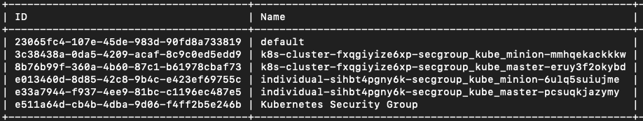
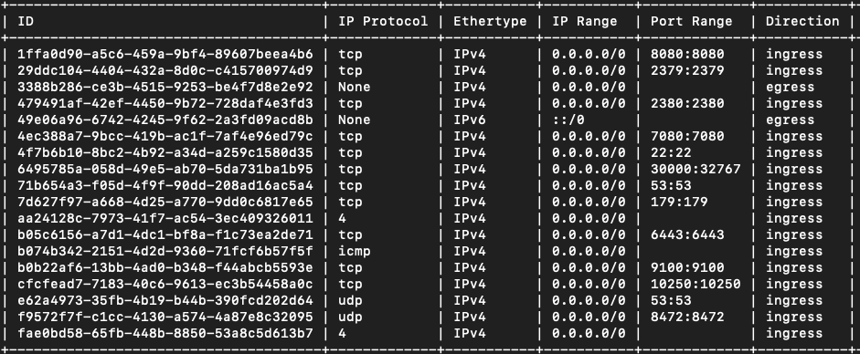
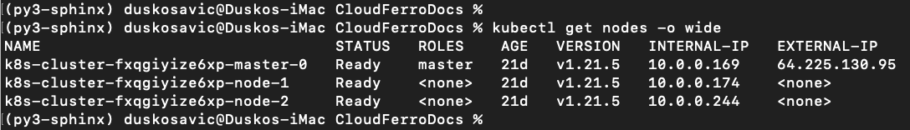
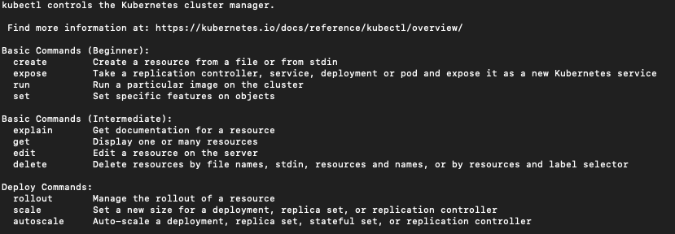
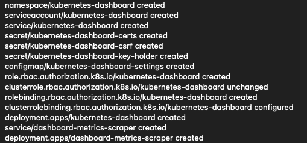
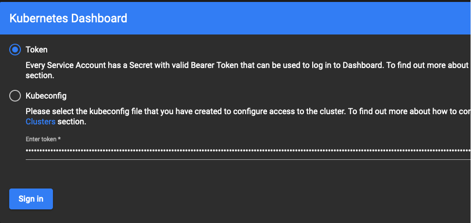
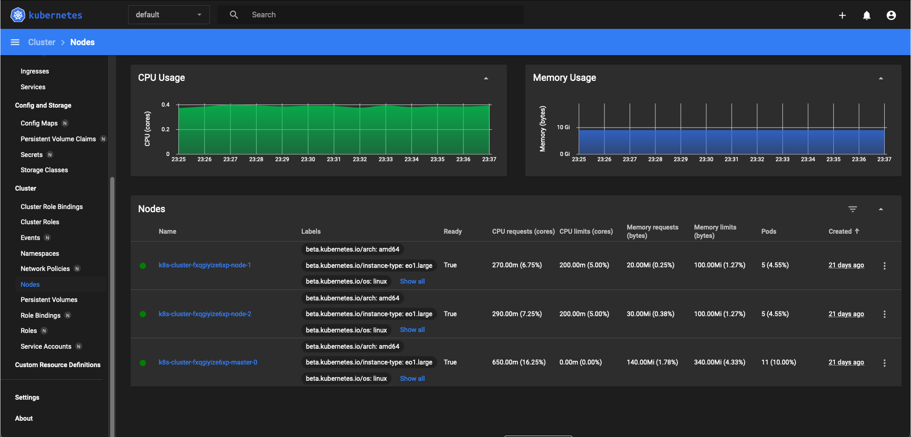

.. Kubernetes documentation master file, created by
   sphinx-quickstart on Sat Dec  4 15:26:27 2021.

.. meta::
   :description: How to access Kubernetes cluster post deployment using Kubectl  
   :keywords: Cloudferro, OpenStack, Magnum, Kubernetes, cluster, network, kubectl, deployment, Kubernetes deployment, post deployment

How To Access Kubernetes Cluster Post Deployment Using Kubectl On Cloudferro OpenStack Magnum
====================================================================================================

Written by `Dusko Savic <https://duskosavic.com>`_.

In this tutorial, you start with a freshly installed Kubernetes cluster on Cloudferro OpenStack server and connect the main Kubernetes tool, **kubectl** and its visual counterpart, the *Dashboard*, to the cloud.

What We Are Going To Cover
--------------------------

 * How to connect **kubectl** to the OpenStack Magnum server

 * How to access clusters with **kubectl**

 * How to install Kubernetes *Dashboard*

Prerequisites
-------------

No. 1 **Hosting**

You need a Cloudferro hosting account with `Horizon interface <https://horizon.cloudferro.com>`_.

No. 2 **Installation of kubectl**

Standard types of **kubectl** installation are described on `Install Tools page <https://kubernetes.io/docs/tasks/tools/>`_ of the official Kubernetes site. 

No. 3 **Installed cluster on Magnum site**

Follow the article `How to Create a Kubernetes Cluster Using Cloudferro OpenStack Magnum <../article_01>`_ to install a Kubernetes cluster using the Horizon interface. 

No. 4. **Creating clusters with CLI**

The article `How To Use Command Line Interface for Kubernetes Clusters On Cloudferro OpenStack Magnum <../article_04>`_ shows creation of clusters with command line interface. 

No. 5 **Connect openstack client to the cloud**

Prepare **openstack** and **magnum** clients by executing *Step 2 Connect OpenStack and Magnum Clients to Horizon Cloud* from article `How To Install OpenStack and Magnum Clients for Command Line Interface to Cloudferro Horizon <../article_03>`_. 

Follow up the steps listed in Prerequisite No. 2 and install **kubectl** on the platform of your choice. Use the existing Kubernetes cluster on Cloudferro or install a new one using the methods outlined in Prerequisites Nos. 3 or 4. Use Step 2 in Prerequisite No. 5 to enable connection of **openstack** and **magnum** clients to the cloud.

Connect Kubernetes Command kubectl to the Cloud
===================================================

Step 1 Download Certificates From the Server
--------------------------------------------

The **openstack** command to download the corresponding configuration file from Magnum has these input parameters:

.. code::

   openstack coe cluster config --help     
   usage: openstack coe cluster config [-h] 
      [--dir <dir>] [--force] [--output-certs]
      [--use-certificate] [--use-keystone]
       <cluster>

   Get Configuration for a Cluster

   positional arguments:
     <cluster>    The name or UUID of cluster to update

   optional arguments:
     -h, --help           show this help message and exit
     --dir <dir>  Directory to save the certificate and config files.
     --force              Overwrite files if existing.
     --output-certs       Output certificates in separate files.
     --use-certificate    Use certificate in config files.
     --use-keystone       Use Keystone token in config files.

You will use **openstack coe cluster config** command to download the files that **kubectl** needs for authentication with the server. Create a new directory called *k8sdir* into which the files will be downloaded:

.. code::
  
   mkdir k8sdir
   
Then download the certificates into that folder:

.. code::
  
   openstack coe cluster config 
      --dir k8sdir 
      --force 
      --output-certs 
      k8s-cluster 

There will be four files:

.. code::

   ls k8sdir
   ca.pem		cert.pem	config		key.pem

Parameter *--output-certs* produces *.pem* files, which are X.509 certificates, originally created so that they can be sent via email. File *config* combines the  *.pem* files and contains all the information needed for **kubectl** to access the cloud. Using *--force* overwrites the existing files (if any), so you are guaranteed to work with only the latest versions of the files from server. 

The result of this command is shown in the row below:

.. code::

   export KUBECONFIG=/Users/duskosavic/CloudferroDocs/k8sdir/config

System variable KUBECONFIG has been initialized and so the **kubectl** command will always have access to the *config* file. 

Step 2 Create KUBERNETES_URL Variable for Kubectl
-------------------------------------------------

The following command will get the HTTPS address through which **kubectl** will connect to the server:

.. code::

   KUBERNETES_URL=$(openstack coe cluster show k8s-cluster 
      | awk '/ api_address /{print $4}')

Then print value of system variable KUBERNETES_URL:

.. code::

   $KUBERNETES_URL

and see that it is *https://64.225.132.135:6443*. The IP address 64.225.132.135 will be different in your case but the port number, *6443*, should be the same across OpenStack family of cloud operating systems.

Step 3 Open Access to Port 6443 on the Server
---------------------------------------------

The port 6443 must be open i.e. set up to ingress traffic. To check its current state, list all security groups with the following CLI command:

.. code::

   openstack security group list

The result will be similar to this:

There are two security group rules for *k8s-cluster*, one for the master node, the other for the minions -- the worker nodes. List security rules for the master node:

.. code::

   openstack security group rule 
      list k8s-cluster-fxqgiyize6xp-secgroup_kube_master-eruy3f2okybd

This is the result:

Port **6443** has *tcp* protocol and the direction is *ingress* so it can receive HTTPS calls from **kubectl**. If it weren't in that state, you would have to set up the security rule to those values. 

Step 4 Verify That kubectl Has Access to the Cloud
--------------------------------------------------

See basic data about the cluster with the following command:

.. code::

   kubectl get nodes -o wide

The result is:

That verifies **kubectl** has proper access to the cloud. 

To see available commands **kubectl** has, use:

.. code::

  kubectl --help 

The listing is too long to reproduce here, but here is how it starts:

**kubectl** also has a long list of options, which are parameters that can be applied to any command. See them with

.. code::

  kubectl options

Deploy and Use the Dashboard 
============================

Step 5 Deploying the Dashboard
------------------------------

There is a visual interface to Kubernetes cluster through a so-called *Dashboard*. Install it with the following command:

.. code::

   kubectl apply 
      -f https://raw.githubusercontent.com/kubernetes/dashboard/v2.4.0/aio/deploy/recommended.yaml

The result is

Step 6 Creating a Sample User 
-----------------------------

Next, you create a bearer token which will serve as an authorization token for the Dashboard. To that end, you will create two local files and "send" them to the cloud using the **kubectl** command. The first file is called *dashboard-adminuser.yaml* and its contents are 

.. code::

   apiVersion: v1
   kind: ServiceAccount
   metadata:
     name: admin-user
     namespace: kubernetes-dashboard

Use a text editor of your choice to create that file, on MacOS or Linux you can use *nano*, like this:

.. code::

   nano dashboard-adminuser.yaml

Install that file on the Kubernetes cluster with this command:

.. code::

   kubectl apply -f dashboard-adminuser.yaml

The second file to create is *nano dashboard-clusterolebinding.yaml*, its contents are 

.. code::

   apiVersion: rbac.authorization.k8s.io/v1
   kind: ClusterRoleBinding
   metadata:
     name: admin-user
   roleRef:
     apiGroup: rbac.authorization.k8s.io
     kind: ClusterRole
     name: cluster-admin
   subjects:
   - kind: ServiceAccount
     name: admin-user
     namespace: kubernetes-dashboard

and the command to send it to the cloud is

.. code::

   kubectl apply -f dashboard-clusterolebinding.yaml 

The final step is to get the bearer token, which is a long string that will authenticate calls to Dashboard:

.. code::

   kubectl 
      -n kubernetes-dashboard 
      get secret $(kubectl -n kubernetes-dashboard get sa/admin-user -o jsonpath="{.secrets[0].name}") 
      -o go-template="{{.data.token | base64decode}}"

The bearer token string will be printed in terminal screen. Copy it to a text editor, it will be needed after you access the Dashboard UI through a HTTPS call.

.. note::

   If the last character of the bearer token string is *%*, it may be a character that denotes the end of the string but is not a part of it. If you copy the bearer string and it is not recognized, try copying it without this ending character *%*.
   
To enable the connection, execute the following command in **separate** terminal window.

.. code::

   kubectl proxy

The result will be something like this:

Then enter this address into the browser:

.. code::

   http://localhost:8001/api/v1/namespaces/kubernetes-dashboard/services/https:kubernetes-dashboard:/proxy/

Enter the token, click on **Sign In** and get the Dashboard UI for the Kubernetes clusters.

The Kubernetes Dashboard organizes working with the cluster in a visual and interactive way. Click on *Nodes* on the left sides to see the nodes that the *k8s-cluster* has. 

What To Do Next 
---------------

The basic Kubernetes command, **kubectl** and its *Dashboard*, have been installed and operational, so you can 

 * deploy apps on the cluster,

 * access multiple clusters,

 * create load balancers,

 * access applications in the cluster using port forwarding,

 * use Service to access application in a cluster,

 * list container images in the cluster

 * use Services, Deployments and all other resources in a Kubernetes cluster. 

