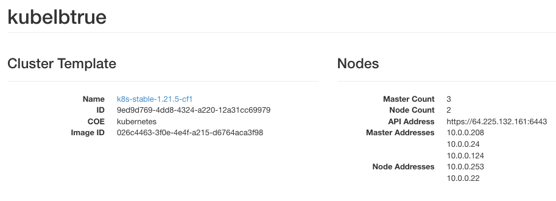

.. Kubernetes documentation master file, created by
   sphinx-quickstart on Sat Dec  4 15:26:27 2021.

.. meta::
   :description: How to create API server LoadBalancer for Kubernetes cluster  
   :keywords: Cloudferro, OpenStack, Magnum, Kubernetes, cluster, network, loadbalancer, load balancer

How To Create API Server LoadBalancer for Kubernetes Cluster On Cloudferro OpenStack Magnum
=================================================================================================

Written by `Dusko Savic <https://duskosavic.com>`_.

Kubernetes schedules containers dynamically, inspects their health, removes the unhealthy ones and replaces them with the new equivalent containers in pods and nodes. Master nodes are the heart of the system, taking care of everything and controlling the worker nodes. If there is just one master node and it fails, the system cannot create additional services, pods and so on. The system would become "highly available" if there were two or more equally functional master nodes and if one failed, the other could swap in, until the first master is recreated again. 

Usually, in a highly available Kubernetes cluster, there will be three master nodes and three worker nodes. The additional number of master nodes both provides redundancy and better network performance, as the masters are dividing the work among themselves. 

A default setup for the Kubernetes cluster is to have one load balancer "in front of" the entire system i.e. an external IP address through which the network / Internet traffic is coming in. The load balancer decides to which of the master nodes to send the incoming traffic, according to chosen strategy, such as *round robin*, *randomly*, using *hashing*, then under various criteria such as *fastest response*, *fewest servers*, *least connections* and there are other strategies as well.  

What We Are Going To Cover
--------------------------

 * How to create a cluster with a single public IP address for access, loadbalanced among master nodes and the other

 * How to disable creation of master loadbalancer. 

 * Comparison of the results  

Prerequisites
-------------

No. 1 **Hosting**

You need a Cloudferro hosting account with `Horizon interface <https://horizon.cloudferro.com>`_.

No. 2 **Creating clusters with CLI**

The article `How To Use Command Line Interface for Kubernetes Clusters On Cloudferro OpenStack Magnum <../article_04>`_ shows creation of clusters with command line interface. 

Step 1 Create Cluster with Master Load Balancer
-----------------------------------------------

In this step, you shall create a cluster with 

 * 3 master nodes and 

 * 3 worker nodes and with a

 * load balancer.

That will be the highly available version of the cluster. 

Here is the CLI command to use:

.. code::

   openstack coe cluster create 
      --cluster-template k8s-stable-1.21.5-cf1  
      --keypair sshkey 
      --master-count 3 
      --node-count 3 
      --timeout 100 
      --master-flavor eo1.large 
      --flavor eo1.large 
      kubelbtrue

The cluster created will be called *kubelbtrue*. The command to create load balancer would be **--master-lb-enabled** but it isn't present. That is because it is the default if the OpenStack software is installed with Neutron module installed (as it is the case on Cloudferro hosting).

After a couple of minutes, the new cluster will be available in the system.

Step 2 Create Cluster Without Master Load Balancer
--------------------------------------------------

The command to disable creation of the master load balancer is **--master-lb-disabled**. If you just add it into the above CLI command, like this:

.. code::

   openstack coe cluster create 
      --cluster-template k8s-stable-1.21.5-cf1  
      --keypair sshkey 
      --master-lb-disabled 
      --master-count 3 
      --node-count 3 
      --timeout 100 
      --master-flavor eo1.large 
      --flavor eo1.large 
      kubelbfalse

you will get the following message:

   **Master node count can only be one if master loadbalancer is disabled.**

In other words, if there are two or more master nodes, the main load balancer will be created. Conversely, to create the system without the main load balancer, the number of master nodes must be exactly **1**. So:

.. code::

   openstack coe cluster create 
      --cluster-template k8s-stable-1.21.5-cf1  
      --keypair sshkey 
      --master-lb-disabled 
      --master-count 1 
      --node-count 3 
      --timeout 100 
      --master-flavor eo1.large -
      -flavor eo1.large 
      kubelbfalse

This cluster will be called *kubelbfalse*.

In this step, you have created a Kubernetes cluster with one master node and the load balancer tied to that node. 

Step 3 The Results
------------------

In Horizon, use commands **Container Infra** => **Clusters** to verify that the clusters have been properly created:

Click on cluster name *kubelbtrue* and see the addresses under Nodes:

There are three master addresses and two node / worker addresses. The number of worker addresses is one less because the autoscaling is turned on and there is no traffic coming from the Internet, so it goes one down. 

Note that the addresses all start with **10.0.0.**, meaning they are taken from the internal network pool. Under **API Address** you see 

.. code::

   API Address https://64.225.132.161:6443

and that is the address of the load balancer -- the address that can be accessed from the external network. The load balancer will then send trafic to the addresses starting with **10.0.0.** i.e. will balance them. 

This is the **Network** => **Network Topology** view of the two clusters:

The blue line is the *external* network, with routers towards other networks. The orange line is *kubelbtrue* network with its five nodes, the green line is the *kubelbfalse* network and it has only three nodes. 

Clicking on *kubelbfalse* name in Clusters view, shows this:

The API address is

.. code::

   API Address https://10.0.0.112:6443

It starts with 10.0.0. so it is an internal address for the cluster. There will be no real load balancing -- all the traffic will go through this and only this address. 

.. note::

   In both cases, the API Address uses port **6443**. The parallel with the well known port for HTTPS traffic, **443**, is obvious. Kubernetes API uses this port but other apps may also use it as they see fit.  

Here is the list of load balancers in the system, after **Network** => **Load Balancers**:

There are two balancers for *k8s-cluster*, two for *kubelbtrue* and exactly none for *kubelbfalse*. 

What To Do Next
---------------

In this article you have demostrated how to create a cluster with and without a load balancer. The next article in the series is `How To Create Floating IP for Servers on Cloudferro OpenStack Magnum <../article_07>`_.

