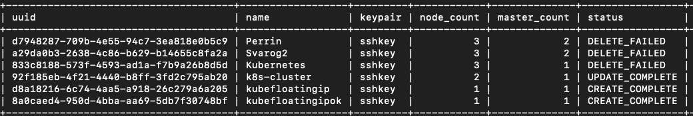
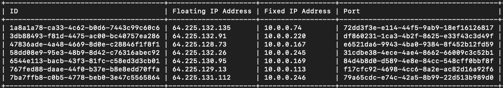
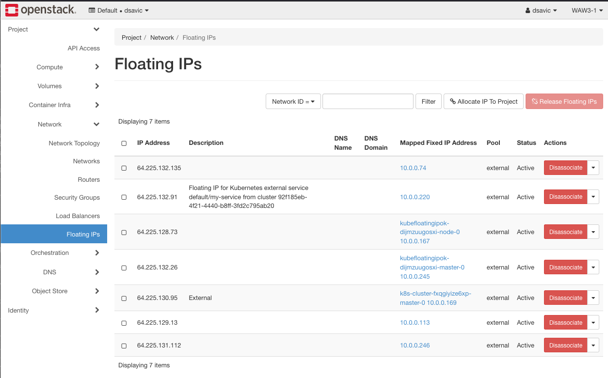

.. Kubernetes documentation master file, created by
   sphinx-quickstart on Sat Dec  4 15:26:27 2021.

.. meta::
   :description: How to create a Kubernetes cluster template 
   :keywords: cluster template, Cloudferro, OpenStack, Magnum, Kubernetes, cluster, network, floating IP, Magnum CLI

How To Create Floating IP for Servers on Cloudferro OpenStack Magnum
====================================================================

Written by `Dusko Savic <https://duskosavic.com>`_.

The usual way of creating a Kubernetes cluster is have all the nodes share one exit point in public network and one source IP address. If there is much demand for the site, the lack of bandwidth may become a problem, as the potential visitors would not be able to enter it. 

Floating IP is an external IP address through which elements of the cluster can receive network traffic directly and independently. In this tutorial, you will create a new Kubernetes cluster with floating IPs automatically attached to all master and worker nodes. As a result, the entire cluster will have more bandwidth. 

What We Are Going To Cover
--------------------------

 * Create a simple Kubernetes cluster with one master and one worker node, with a minimum of parameters

 * Add floating IP addresses to each node by creating an identical cluster with parameter **--floating-ip-enabled** added in the middle

 * The pros, the cons, and the risks of using floating IPs in the cluster

Prerequisites
-------------

No. 1 **Hosting**

You need a Cloudferro hosting account with `Horizon interface <https://horizon.cloudferro.com>`_.

No. 2 **Creating clusters with CLI**

The article `How To Use Command Line Interface for Kubernetes Clusters On Cloudferro OpenStack Magnum <../article_04>`_ will introduce you to creation of clusters using a command line interface. 

No. 3 **Connect openstack client to the cloud**

Prepare **openstack** and **magnum** clients by executing *Step 2 Connect OpenStack and Magnum Clients to Horizon Cloud* from article `How To Install OpenStack and Magnum Clients for Command Line Interface to Cloudferro Horizon <../article_03>`_. 

No. 4 **Security Groups** 

Even a minimal cluster can generate dozens of security rules and drive the number of security groups and security group rules over the quota. For more info, see `How to Use Security Groups to Tighten Security Using Cloudferro OpenStack Magnum <../article_014/index.html>`_.

No. 5 **Check available quotas**

You are going to create two minimal clusters, each with with one master and one worker node. Check the state of the resources with Horizon commands **Computer** => **Overview** before issuing the following commands for cluster creation.

Step 1 Install Kubernetes Cluster Without Floating IPs for the Nodes
--------------------------------------------------------------------

In this step, you will create a minimal cluster without floating IPs attached to workers. Typical case use of such clusters are, for example

 * clustering for high availability,

 * network virtual appliances,
 
 * working with multiple TLS endpoints without re-encryption. 

Here is the CLI command 

.. code::

   openstack coe cluster create 
      --cluster-template k8s-stable-1.21.5-cf1  
      --keypair sshkey 
      --master-count 1 
      --node-count 1 
      --timeout 100 
      --master-flavor eo1.large 
      --flavor eo1.large 
      kubefloatingip

to install a new Kubernetes cluster *kubefloatingip* with one master and one worker node, using the default cluster template *k8s-stable-1.21.5-cf1*. 

It is possible to manually create a floating IP for this cluster but in situation when all workers need have the connection to ingress traffic, inclusion of parameter **--floating-ip-enabled** is both simple and efficient at the same time. 

In Step 1, you have created a "normal" Kubernetes cluster, while in Step 2, you are going to enhanced it with floating IPs for each workder node. 

Step 2 Install Kubernetes Cluster With Floating IPs for the Nodes
-----------------------------------------------------------------

The following command is identical to the one above, except that one parameter, **--floating-ip-enabled**, has been added in the middle:

.. code::

   openstack coe cluster create 
      --cluster-template k8s-stable-1.21.5-cf1  
      --keypair sshkey 
      --floating-ip-enabled 
      --master-count 1 
      --node-count 1 
      --timeout 100 
      --master-flavor eo1.large 
      --flavor eo1.large 
      kubefloatingipok

The name of the new cluster is *kubefloatingipok*. The CLI command shows the creation to have succeeded:

Show the existing floating IPs information with the following command:

.. code::

   openstack floating ip list

The Horizon interface, after commands **Network** => **Floating IPs**, is more user-friendly and will let you see further information by clicking on blue links:

In particular, the IP addresses ending in **73** and **26** belong to *kubefloatingipok* *master* and *node*, respectively. There are no such floating IPs generated for *kubefloatingip*. 

.. note::

   Floating IP with address 64.225.132.91 has been created through **kubectl**, the native command for creation of Kubernetes clusters. 

   That exact procedure, however, is beyond the scope of this article. 

In Step 2, you have created a cluster in which every worker has a floating IP address -- an Internet IP address attached to it. 

Step 3 Pros and Cons
--------------------

In Step 3, you will weigh arguments *pro et contra* of using the parameter **--floating-ip-enabled** in Kubernetes cluster creation. 

A floating IP is not permanently tied to any particular node. Once a node fails, the floating IP can automatically "*float*" (hence the name "*floating*") to a substitute node while outside users would never notice the difference in availability. 

Floating IPs, as public, routable IP addresses, are essential

  * to boost connectivity and produce

  * high availability of the cluster.

With floating IPs, the cluster continues to deliver even if the underlying hardware or software failed due to a malfunction. 

Here are some cases in which using floating IPs is crucial: 

 * mission critical applications, 

 * systems with frequent administration changes, or with

 * frequent upgrades. 

On the other hand, the more elements of the cluster are exposed to the Internet through floating IP addresses, the greater the **security risk** is going to be. OpenStack and Magnum will generate the protective security groups and rules automatically and it is crucial not to temper with these rules in production. See *Prerequisite No. 4* for more info about security of the cluster. 

The next article in the series is `Creating Additional Nodegroups in Kubernetes Cluster on Cloudferro OpenStack Magnum <../article_08>`_.

 

