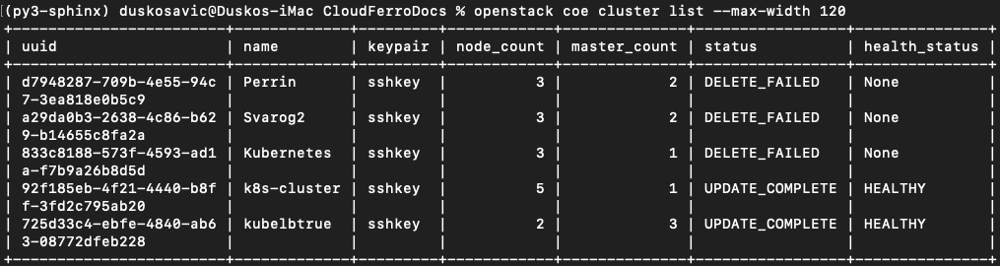
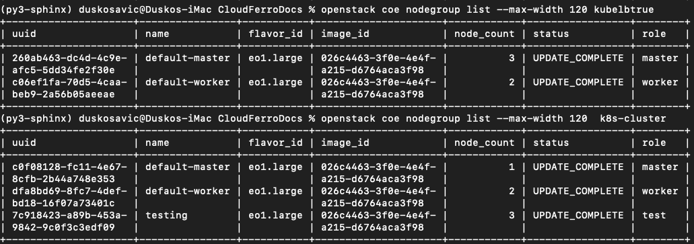
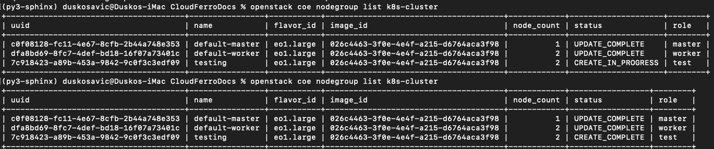
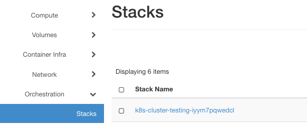
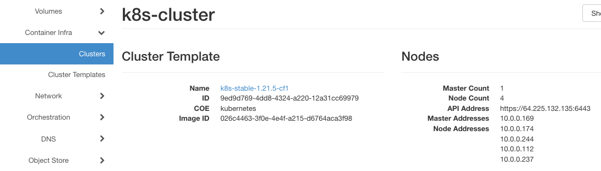
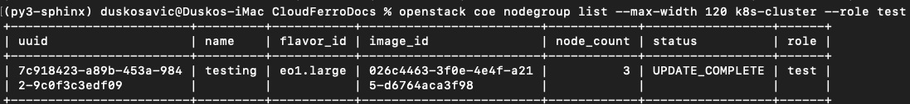
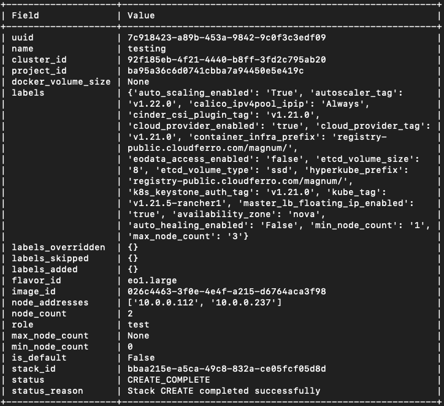
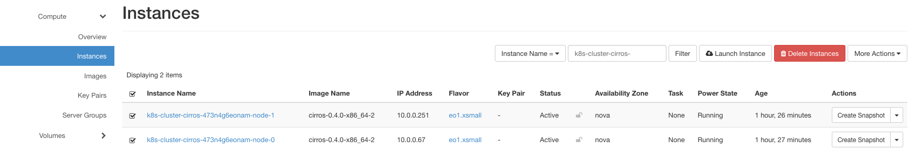
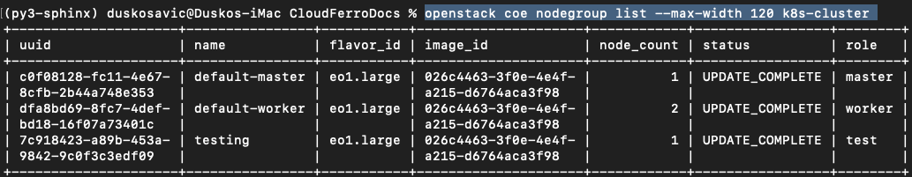
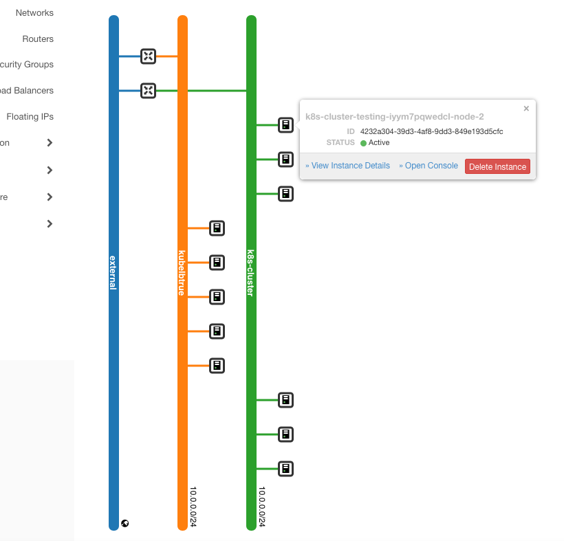

.. Kubernetes documentation master file, created by
   sphinx-quickstart on Sat Dec  4 15:26:27 2021.

.. meta::
   :description: How to create a Kubernetes cluster template 
   :keywords: Cloudferro, OpenStack, Magnum, Kubernetes, cluster, nodegroups, Kubernetes nodegroups, creating nodegroups

Creating Additional Nodegroups in Kubernetes Cluster on Cloudferro OpenStack Magnum
=======================================================================================

Written by `Dusko Savic <https://duskosavic.com>`_.

Once you create a Kubernetes cluster on OpenStack Magnum, it is possible to use a CLI group of commands **openstack coe nodelist** to add or delete the nodes. With this, you can repurpose the cluster to include various images, change volume access, set up max and min values for the number of nodes and so on. In this article you get hands on experience combining the CLI commands and Horizon visual aspects of cluster creation. 

There are five subcommands for **nodegroup** command:

.. code::

   coe nodegroup create

   coe nodegroup delete

   coe nodegroup list

   coe nodegroup show

   coe nodegroup update

What We Are Going To Cover
--------------------------

 * The structure of command **openstack coe nodelist**

 * How to produce manageable output from **nodelist** set of commands

 * How to **list** what nodegroups are available in a cluster

 * How to **show** the contents of one particular *nodegroup* in a cluster

 * How to **create** a new *nodegroup*

 * How to **delete** an existing *nodegroup*

 * How to **update** *nodegroups*

 * How to resize a nodegroup

 * The benefits of using nodegroups in Kubernetes clusters

Prerequisites
-------------

No. 1 **Hosting**

You need a Cloudferro hosting account with `Horizon interface <https://horizon.cloudferro.com>`_.

No. 2 **Creating clusters with CLI**

The article `How To Use Command Line Interface for Kubernetes Clusters On Cloudferro OpenStack Magnum <../article_04>`_ will introduce you to creation of clusters using a command line interface. 

No. 3 **Connect openstack client to the cloud**

Prepare **openstack** and **magnum** clients by executing *Step 2 Connect OpenStack and Magnum Clients to Horizon Cloud* from article `How To Install OpenStack and Magnum Clients for Command Line Interface to Cloudferro Horizon <../article_03>`_. 

No. 4 **Check available quotas**

Before creating additional node groups check the state of the resources with Horizon commands **Computer** => **Overview**.

Step 1 Access the Current State of Clusters and Their Nodegroups
----------------------------------------------------------------

Here is which clusters are available in the system:

.. code::

   openstack coe cluster list --max-width 120

The default process of creating Kubernetes clusters on OpenStack Magnum produces two nodegroups, **default-master** and **default-worker**. Use commands

.. code::

   openstack coe nodegroup list kubelbtrue

   openstack coe nodegroup list k8s-cluster

to list default nodegroups for those two clusters, *kubelbtrue* and *k8s-cluster*.

The **default-worker** node group cannot be removed or reconfigured so plan ahead when creating the base cluster.

Step 2 How to Create a New Nodegroup
------------------------------------

In this step you learn about the parameters available for the **nodegroup create** command. This is the general structure:

.. code::

   openstack coe nodegroup create [-h] 
   [--docker-volume-size <docker-volume-size>] 
   [--labels <KEY1=VALUE1,KEY2=VALUE2;KEY3=VALUE3...>] 
   [--node-count <node-count>]
   [--min-nodes <min-nodes>] 
   [--max-nodes <max-nodes>] 
   [--role <role>] 
   [--image <image>] 
   [--flavor <flavor>]
   [--merge-labels]
   <cluster> <name>

You will now create a nodegroup of two members, it will be called *testing*, the  role will be called *test*, and add it to the cluster *k8s-cluster*:

.. code::

   openstack coe nodegroup create 
      --node-count 2 
      --role test  
      k8s-cluster testing

Then use the command 

.. code::

   openstack coe nodegroup list k8s-cluster

to list the nodegroups twice. The first time, it will be in status of creating, the second time, after a few seconds, it will have been created already. 

In Horizon, use command **Orchestration** => **Stacks** to list the mechanisms that create new instances. In this case, the stack looks like this:

Still in Horizon, click on commands **Contaner Infra** => **Clusters** => **k8s-clusters** and see that there are now five nodes in total:

Step 3 Using **role** to Filter Nodegroups in the Cluster
---------------------------------------------------------

It is possible to filter node groups according to the role. Here is the command to show only the *test* nodegroup:

.. code::

   openstack coe nodegroup list k8s-cluster --role test

Several node groups can share the same role name. 

The roles can be used to schedule the nodes when using the **kubectl** command directly on the cluster.

Step 4 Show Details of the Nodegroup Created
--------------------------------------------

Command **show** presents the details of a nodegroup in various formats -- *json*, *table*, *shell*, *value* or *yaml*. The default is *table* but use parameter **--max-width** to limit the number of columns in it:

.. code::

   openstack coe nodegroup show --max-width 80 k8s-cluster testing

Step 5 Delete the Existing Nodegroup
------------------------------------

In this step you shall try to create a nodegroup with small footprint:

.. code::

   openstack coe nodegroup create 
      --node-count 2 
      --role test 
      --image cirros-0.4.0-x86_64-2 
      --flavor eo1.xsmall 
      k8s-cluster cirros
 
After one hour, the command was cancelled and the creation has failed. The resources will, however, stay frozen in the system so here is how to delete them. 

One way is to use the CLI **delete** subcommand, like this:

.. code::

   openstack coe nodegroup delete k8s-cluster cirros

The status will be changed to DELETE_IN_PROGRESS.

Another way is to find the instances of those created nodes and delete them through the Horizon interface. Find the existing instances with commands **Compute** => **Instance** and filter by *Instance Name*, with text *k8s-cluster-cirros-*. It may look like this:

and then delete them by clicking on red button **Delete Instances**.

You will get a confirmation text in cloud in the upper right corner. 

Regardless of the way, the instances will not be deleted immediately, but rather *scheduled* to be deleted in some near future. 

The default master and worker node groups cannot be deleted but all the others can.

Step 6 Update the Existing Nodegroup
------------------------------------

In this step you will directly update the existing nodegroup, rather than adding and deleting them in a row. The example command is:

.. code::

   openstack coe nodegroup update k8s-cluster testing 
      replace min_node_count=1

Instead of **replace**, it is also possible to use verbs **add** and **delete**. 

In the above example, you are setting up the minimum value of nodes to 1. (Previously it was **0** as parameter **min_node_count** was not specified and its default value is **0**.)

Step 7 Resize the Nodegroup
---------------------------

Resizing the *nodegroup* is similar to resizing the cluster, with the addition of parameter **--nodegroup**. Currently, the number of nodes in group *testing* is 2. Make it **1**:

.. code::

   openstack coe cluster resize k8s-cluster
      --nodegroup testing 1

To see the result, apply the command

.. code::

   openstack coe nodegroup list --max-width 120 k8s-cluster

and get:

Cluster cannot be scaled outside of min-nodes/max-nodes set when nodegroup was created.

Here is what the state of the networks looks like after all these changes (commands **Network** => **Network Topology** => **Small** in Horizon interface):

The Benefits of Using Nodegroups
--------------------------------

The notion of *nodegroups* helps you separate identities within a cluster. Separation of roles can

 * limit the scope of damage if a given group is compromised, 

 * regulate the number of API requests originating from a certain group, and 

 * create scopes of privileges to specific node types and related workloads.

Other uses of nodegroup roles also include:

 * for testing purposes,

 * separate nodes that run on baremetal hardware as opposed to nodes that run on virtual machines,

 * control availability across regions and zones,

 * nodes in a group can be created, upgraded and deleted individually, without affecting the rest of the cluster.

Nodegroups also allow you to start small, create a cluster with minimal number of resources and then expand and correct as needed during the development.

