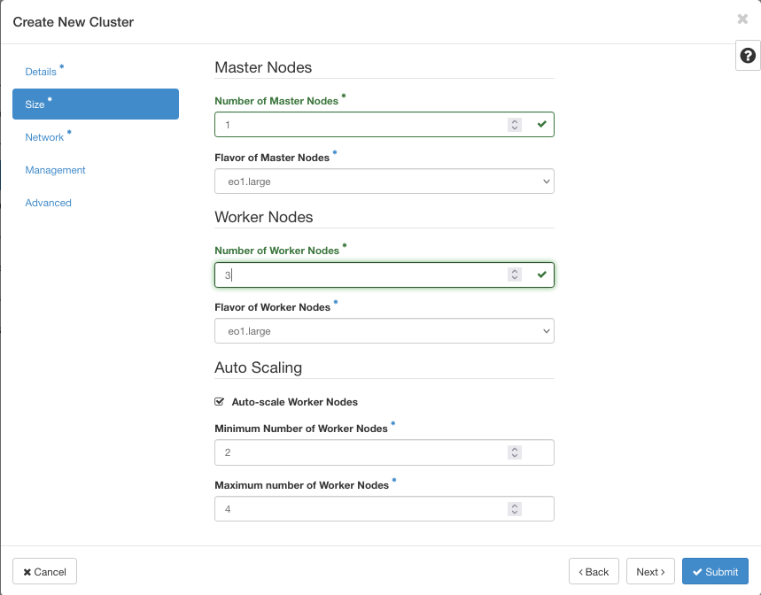
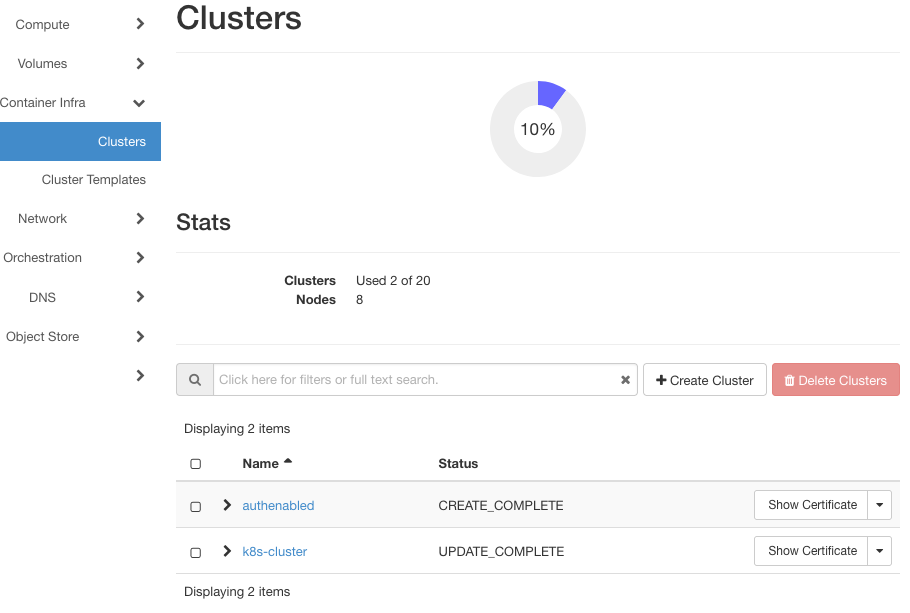
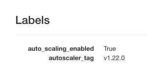
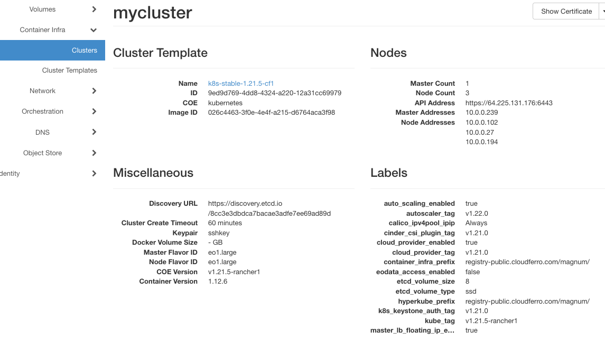
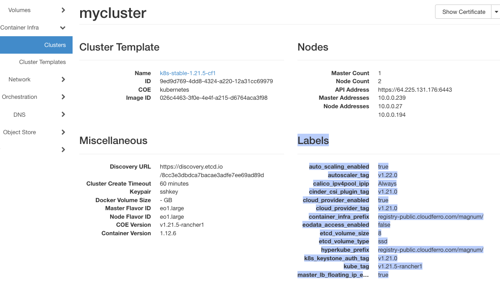
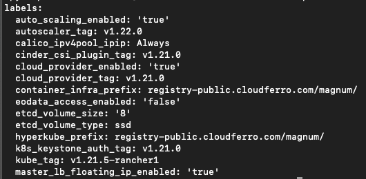

.. Kubernetes documentation master file, created by
   sphinx-quickstart on Sat Dec  4 15:26:27 2021.

.. meta::
   :description: How to autoscale Kubernetes Cluster 
   :keywords: Cloudferro, OpenStack, Magnum, Kubernetes, cluster, nodegroups, Kubernetes nodegroups, creating nodegroups

Autoscaling Kubernetes Cluster Resources on Cloudferro OpenStack Magnum
=======================================================================

Written by `Dusko Savic <https://duskosavic.com>`_.

When **autoscaling of Kubernetes clusters** is turned on, the system can

 * Add resources when the demand is high, or

 * Remove unneeded resources when the demand is low and thus keep the costs down.

 * The whole process can be automatic, helping the administrator concentrate on the more important tasks at hand.

This article explains various commands to resize or scale the cluster and will lead to a command to automatically create an autoscalable Kubernetes cluster for OpenStack Magnum.  

What We Are Going To Cover
--------------------------

 * Definitions of horizontal, vertical and nodes scaling

 * Define autoscaling when creating the cluster in Horizon interface

 * Define autoscaling when creating the cluster using the CLI

 * Get cluster template labels from Horizon interface

 * Get cluster template labels from the CLI

Prerequisites
-------------

No. 1 **Hosting**

You need a Cloudferro hosting account with `Horizon interface <https://horizon.cloudferro.com>`_.

No. 2 **Creating clusters with CLI**

The article `How To Use Command Line Interface for Kubernetes Clusters On Cloudferro OpenStack Magnum <../article_04>`_ will introduce you to creation of clusters using a command line interface. 

No. 3 **Connect openstack client to the cloud**

Prepare **openstack** and **magnum** clients by executing *Step 2 Connect OpenStack and Magnum Clients to Horizon Cloud* from article `How To Install OpenStack and Magnum Clients for Command Line Interface to Cloudferro Horizon <../article_03>`_. 

No. 4. **Resizing Nodegroups**

Step 7 of article `Creating Additional Nodegroups in Kubernetes Cluster on Cloudferro OpenStack Magnum <../article_08>`_ shows example of resizing the nodegroups for autoscaling. 

No. 5 **Creating Clusters**

Step 2 of article `How to Create a Kubernetes Cluster Using Cloudferro OpenStack Magnum <../article_01>`_ shows how to define master and worker nodes for autoscaling. 

There are three different autoscaling features that a Kubernetes cloud can offer:

Horizontal Pod Autoscaler
-------------------------

Scaling Kubernetes cluster horizontally means increasing or decreasing the number of running pods, depending on the actual demands at run time. Parameters to take into account are the usage of CPU and memory, as well as the desired minimum and maximum numbers of pod replicas. 

Horizontal scaling is also known as "scaling out" and is shorthened as HPA.

Vertical Pod Autoscaler
-----------------------

Vertical scaling (or "scaling up", VPA) is adding or subtracting resources to and from an existing machine. If more CPUs are needed, add them. When they are not needed, shut some of them down. 

Cluster Autoscaler
------------------

HPA and VPA reorganize the usage of resources and the number of pods, however, there may come a time when the size of the system itself prevents from satisfying the demand. The solution is to autoscale the cluster itself, to increase or decrease the number of nodes on which the pods will run on. 

Once the number of nodes is adjusted, the pods and other resources need to rebalance themselves across the cluster, also automatically. The number of nodes acts as a physical barrier to the autoscaling of pods.

All three models of autoscaling can be combined together. 

Define Autoscaling When Creating a Cluster
------------------------------------------

You can define autoscaling parameters while defining a new cluster, using window called **Size** in the cluster creation wizard: 

Specify a minimum and maximum number of worker nodes. If these values are 2 and 4 respectively, the cluster will have not less that 2 nodes and not more than 4 nodes at any time. If there is no traffic to the cluster, it will be automatically scaled to 2 nodes. In this example, the cluster can have 2, 3, or 4 nodes depending on the traffic. 

For the entire process of creating a Kubernetes cluster in Horizon, see Prerequisites No. 5.

Autoscaling Node Groups at Run Time
-----------------------------------

To change the size of cluster at run time, you can add or subtract node groups, which also have parameters for the minimum and maximum values of autoscaling. 

See Prerequisites No. 4 for detailed examples of using the **openstack coe nodegroup** family of commands.

Autoscaling Labels for Clusters
-------------------------------

There are three labels for clusters that influence autoscaling:

 * **auto_scaling_enabled** -- if true, it is enabled

 * **min_node_count** -- the minimal number of nodes

 * **max_node_count** -- the maximal number of nodes, at any time.

When defining cluster through the Horizon interface, you are actually setting up these cluster labels. 

List clusters with **Container Infra** => **Cluster** and click on the name of the cluster. Under *Labels*, you will find the current value for  **auto_scaling_enabled**.

If true, it is enabled, the cluster will autoscale.

Create New Cluster Using CLI With Autoscaling On
------------------------------------------------

The command to create a cluster with CLI must encompass all of the usual parameters as well as **all of the labels** needed for the cluster to function. The peculiarity of the syntax is that label parameters must be one single string, without any blanks inbetween. Showing it in a text like this is almost impossible so here is a version of the entire command that you can copy and paste directly to the CLI in terminal. 

The command is:

   **openstack coe cluster create mycluster --cluster-template k8s-stable-1.21.5-cf1 --keypair sshkey --master-count 1 --node-count 3 --labels auto_scaling_enabled=true,autoscaler_tag=v1.22.0,calico_ipv4pool_ipip=Always,cinder_csi_plugin_tag=v1.21.0,cloud_provider_enabled=true,cloud_provider_tag=v1.21.0,container_infra_prefix=registry-public.cloudferro.com/magnum/,eodata_access_enabled=false,etcd_volume_size=8,etcd_volume_type=ssd,hyperkube_prefix=registry-public.cloudferro.com/magnum/,k8s_keystone_auth_tag=v1.21.0,kube_tag=v1.21.5-rancher1,master_lb_floating_ip_enabled=true**

The name will be *mycluster*, one master node and three worker nodes in the beginning. You could have also added 

   **,min_node_count=1,max_node_count=3**

at the end of the above command to explicitely define the min and max number of nodes for autoscaling. 

This is the result after the creation:

Three worker node addresses are active: **10.0.0.102**, **10.0.0.27**, and **10.0.0.194**.

There is no traffic to the cluster so the autoscaling immediately kicked in. A minute or two after the creation was finished, the number of worker nodes fell down by one, to addresses **10.0.0.27** and **10.0.0.194** -- that is autoscaling at work. 

How to Obtain All Labels From Horizon Interface
-----------------------------------------------

Use **Container Infra** => **Clusters** and click on the cluster name. You will get plain text in browser, just copy the rows under **Labels** and paste them to the text editor of your choice. 

In text editor, manually remove line ends and make one string without breaks and carriage returns, then paste it back to the command. 

How To Obtain All Labels From the CLI
-------------------------------------

There is a special command which will produce labels from a cluster:

.. code::

   openstack coe cluster template show k8s-stable-1.21.5-cf1 -c labels -f yaml

This is the result:

That is *yaml* format, as specified by the **-f** parameter. The rows represent label values and your next action is to create one long string without line breaks as in the previous example, then form the CLI command.

Use Labels String When Creating Cluster in Horizon
--------------------------------------------------

The long labels string can be used when creating the cluster manually, i.e. from Horizon interface. See *Step 4 Define Labels* in Prerequisites No. 2.

What To Do Next
---------------

Autoscaling is similar to autohealing of Kubernetes clusters and both bring automation to the table. They also guarantee that the system will autocorrect as long as it is within its basic parameters. Use autoscaling of cluster resources as much as you can!
