.. Kubernetes documentation master file, created by
   sphinx-quickstart on Sat Dec  4 15:26:27 2021.

.. meta::
   :description: How to autoscale Kubernetes Cluster 
   :keywords: Cloudferro, OpenStack, Magnum, Kubernetes, cluster, nodegroups, Kubernetes nodegroups, creating nodegroups

How to Connect Two Instances Through a Private Network on Cloudferro OpenStack Magnum
========================================================================================

Written by `Dusko Savic <https://duskosavic.com>`_.

In this tutorial, you will connect two instances with different operating systems installed, to communicate over a private network, using OpenStack Magnum and Horizon as the visual interface. 

What We Are Going To Cover
--------------------------

 * How to set up a private network using Horizon interface

 * How to set up a private instance with Centos 7 installed

 * How to set up a private instance with Ubuntu 18.04 installed

 * Testing mutual network access from consoles of these instances

Prerequisites
-------------

No. 1 **Hosting**

You need a Cloudferro hosting account with `Horizon interface <https://horizon.cloudferro.com>`_.

No. 2 **Create and Manage a Network in OpenStack**

Article `How To Create and Manage Networks on Cloudferro OpenStack Magnum <../article_04>`_ shows how to create and set up a new private network for use either solo or in conjunction with Kubernetes clusters.

Step 1 Create a New Private Network on Cloudferro OpenStack Magnum
------------------------------------------------------------------

In this step, you are going to create a new private network and use it later on to attach private instances that you want to connect through that network. 

To do that, follow up the Prerequisites article No. 2. You will end up creating a new network, called *myPrivateNetwork*. 

Step 2 Set Up a Private Instance With Centos 7 Installed
--------------------------------------------------------

In this step, you create a new instance (virtual machine) with venerable Centos 7 operating system. It is very stable and is widely used for web servers. 

Start the creation by clicking on main menu option **Compute** => **Instances** which will show a list of instances in the system. 

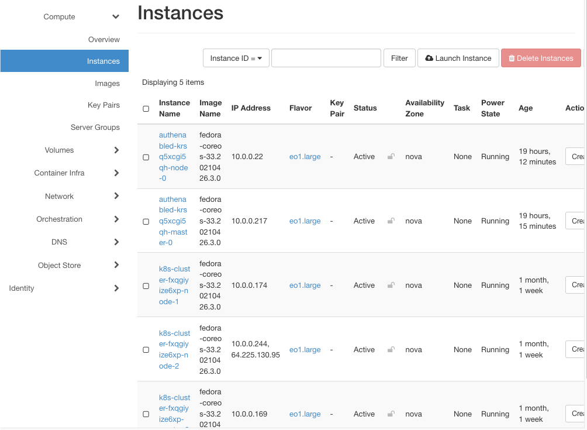

The instances shown have been automatically created during the generation of clusters *authenabled* and *k8s-cluster*. They all share the same image name, *fedora-coreos-33.20210426.3.0*, as that is one of the rare images that is supported in OpenStack when it comes to Kubernetes clusters. 

.. note::

   Their IP addresses are all different, starting with *10.0.0.* and belonging to the pool of addresses for private networks. There is one instance, *k8s-cluster-fxqgiyize6xp-node-2*, that also has the "outside" address of **64.225.130.95**, which means it can be directly accessed from the Internet. 

Click on button **Launch Instance** and start a wizard to **Launch Instance**. 

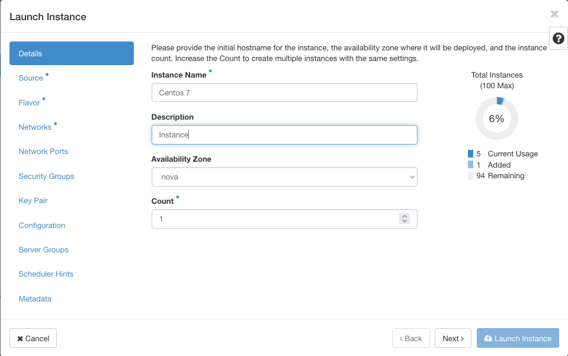

Click on blue button **Next** and come to option **Source** to define the image from which to install the virtual machine. In this case, select Centos 7 by clicking on the up arrow to the right of that row. The row under title **Allocated** will become *Centos 7*:

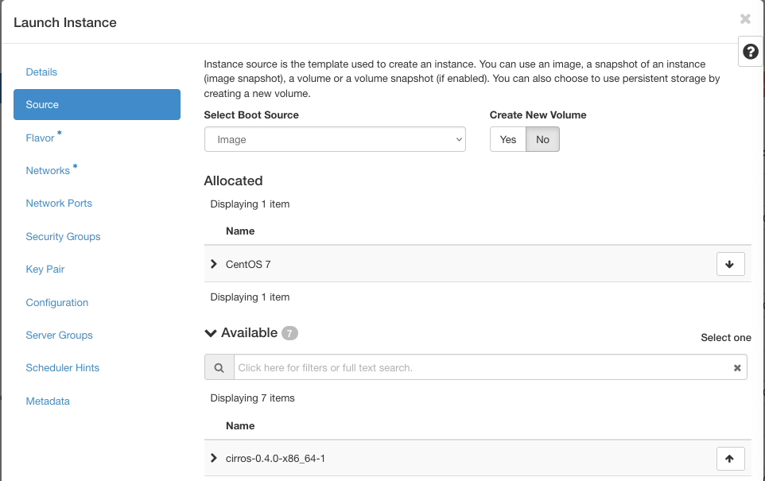

Click on blue button **Flavor** on the left screen and then select **eo1.large**, which will give your instance 8 GB or RAM and 32 GB of space on disk. 

Then click on **Networks** and select *myPrivateNetwork*:

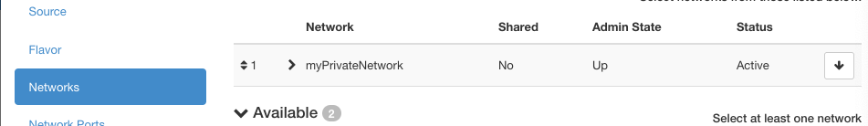

Having entered parameters for all options with an asterisk, the button **Launch Instance** in the bottom right corner becomes available, so click on it. 

After a minute or two, the instance becomes available in the list of instances:

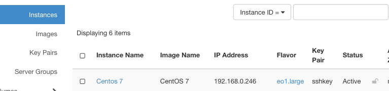

In this step, you have created a new instance with Centos 7 installed on it. You have also attached the new instance to the existing network, *myPrivateNetwork*. 

Step 3 How to Set Up a Private Instance With Ubuntu 18.04 Installed
-------------------------------------------------------------------

In this step, you are going to create a new instance with the identical parameters as above, except that the name will be *Ubuntu1804* and will use the image *Ubuntu 18.04 LTS*. 

This is the result:

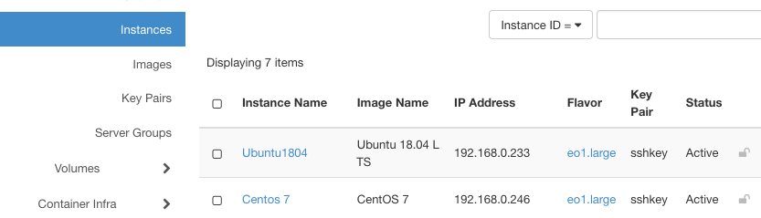

Their IP addresses are:

 * Ubuntu 18.04 LTS 	192.168.0.233

 * CentOS 7 			192.168.0.246

Use again the commands **Network** => **Network Topology** => **Normal** to show the state of the network graphically:

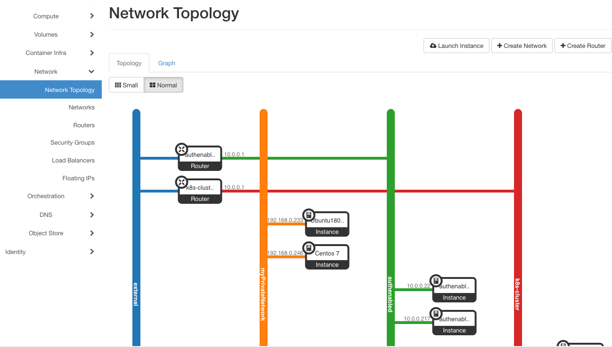

In this step, you have created an instance of *Ubuntu 18.04* operating system and shown that there are two instances attached to the same network. 

Step 4 Enter the Console for Centos 7 Instance and Ping Ubuntu Server
---------------------------------------------------------------------

Enter console for the *Centos 7* instance by clicking on its name in the list of instances, then on tab *Console*:

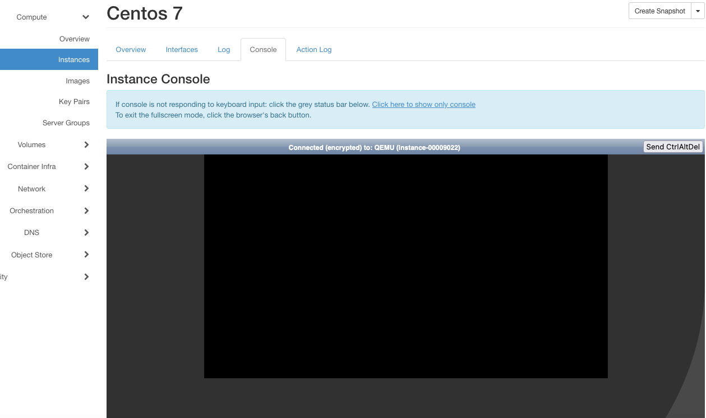

To be sure, click on link *Click here to show only console* or, if that is not enough, click on the grey header line. Then wait, within a minute or so the virtual machine will reboot and you'll get a starting screen like this:

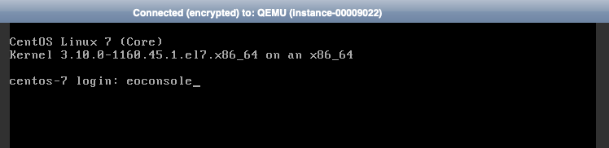

Enter user name **eoconsole**, enter your password twice and log in as *eoconsole* user:

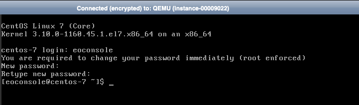

Now you can ping the Ubuntu instance and "see if it is there". Technically, ping the network address for instance *Ubuntu1804*:

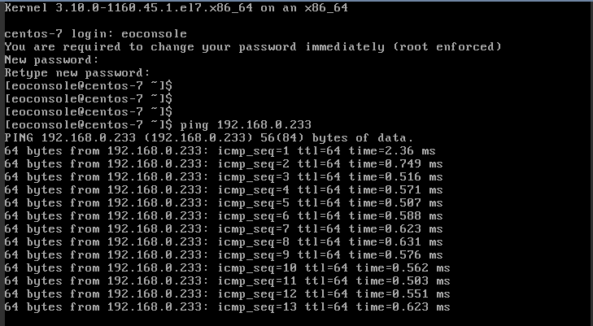

It returns chunks of 64 bytes, signifying that the connection to the server with address was successful.

The command for pinging would be:

.. code::

   ping 192.168.0.233

Also, once in the console, you can use the following command to learn the IP address of the instance:

.. code::

   ip a

Step 5 Enter the Console on Ubuntu Server and Ping Centos 7 Server
------------------------------------------------------------------

In **Compute** => **Instances** list in Horizon, click on *Ubuntu*, then on *Console* tab and get to the console. It will load immediately for login:

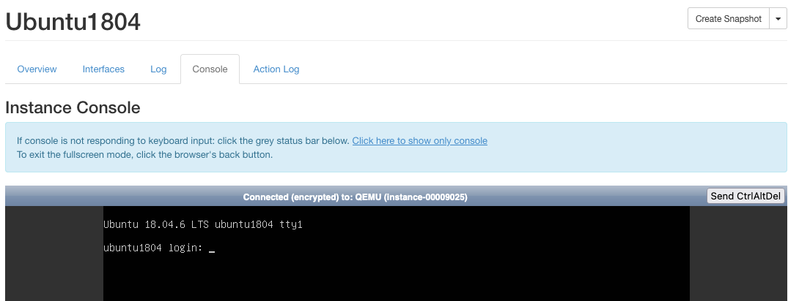

Enter *eoconsole* for login and then a new password. The command

.. code::

   ip a

produces something like this:

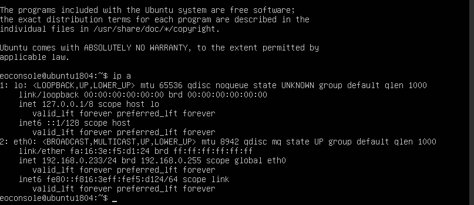

Now ping the *Centos 7* instance:

Again, the returned packets of data show that the instances are on the same network.

What To Do Next
---------------

Connecting independent instances directly through a network increases their security as compared to them being connected via a normal HTTP call. 

In general, these instances will stand stand on their own and not be a part of a Kubernetes cluster. You could place a new instance into an already existing network for a Kubernetes cluster, but the security rules attached to nodes would prevent any intrusion from the instance to the rest of the cluster. 

