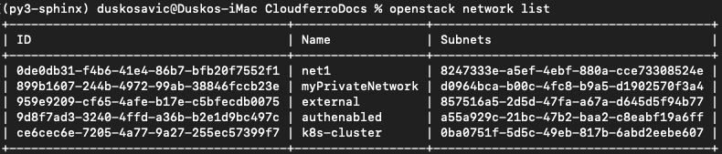

.. Kubernetes documentation master file, created by
   sphinx-quickstart on Sat Dec  4 15:26:27 2021.

.. meta::
   :description: How To Create and Manage Networks on Cloudferro OpenStack Magnum 
   :keywords: Cloudferro, OpenStack, Magnum, Kubernetes, networks

How To Create and Manage Networks on Cloudferro OpenStack Magnum
================================================================

Written by `Dusko Savic <https://duskosavic.com>`_.

What We Are Going To Cover
--------------------------

 * How to create a network through a web interface (Horizon site)

 * How to create a network using the Command Line Interface

 * How to create a subnet using the CLI

 * How to visually verify the results 

Prerequisites
-------------

No. 1 **Hosting**

You need a Cloudferro hosting account with `Horizon interface <https://horizon.cloudferro.com>`_.

No. 2 **Creating clusters with CLI**

The article `How To Use Command Line Interface for Kubernetes Clusters On Cloudferro OpenStack Magnum <../article_04>`_ will introduce you to creation of clusters using a command line interface. 

No. 3 **Connect openstack client to the cloud**

Prepare **openstack** and **magnum** clients by executing *Step 2 Connect OpenStack and Magnum Clients to Horizon Cloud* from article `How To Install OpenStack and Magnum Clients for Command Line Interface to Cloudferro Horizon <../article_03>`_. 

Step 1 Set Up a Private Network Using Horizon Interface
-------------------------------------------------------

In this step, you will create a new network using the Horizon interface. Start by clicking on commands **Network** => **Networks** to bring the list of networks on screen:

The *external* network is always present and serves as a connection to the outside world. Two other networks *authenabled* and *k8s-cluster* have been made as a byproduct of previous Kubernetes clusters creation. 

You are now going to create a new network from scratch. It's name will be *myPrivateNetwork*. 

Click on button **+ Create Network** and give it a name in the following wizard screen:

Click on blue button **Next** and define a subnet *myPrivateSubnet*. In field **Network Address** enter a network address in CIDR format, in this case let it  be **192.168.0.0/24**. 

.. image:: create_subnet.png

Click on blue button **Next** and define subnet details. 

For this tutorial, leave all the fields empty, click on button **Create** and create the network. 

Click on *myPrivateNetwork* in the list and see that the network has a subnet that you created but that it also has a port, which was created automatically. 

To see what is created so far, click on **Network** => **Network Topology** and see that there is an orange line (called *myPrivateNetwork*) which represents the new network. Note that other networks (one blue, one green, and one red) have instances attached to them, while the orange has none. 

Click on button **Normal** to show a detailed view. 

In this step, using web inteface you have 

 * created a new network, with its subnet and port and 

 * presented it graphically. 

Step 2 Set Up a Network Using the Command Line Interface
--------------------------------------------------------

The main CLI command for networks is **openstack network**. Use its subcommand **list** to present all of the networks available in the system:

.. code::

   openstack network list

The result is:

You have created network called *myPrivateNetwork* in the first part of this article. 

Networks for Kubernetes clusters must have subnets so that the nodes and pods may communicate internally, so you are going to create a network with subnet. 

Create a network *net1* with this command:

.. code::

   openstack network create net1 --max-width 80

Defining parameter *--max-width* helps format the output so that it can be read on smaller row sizes:

Confirm with 

.. code::

   openstack network list

that a new network called *net1* was created. 

In this step, you have created a new network with a minimum number of parameters, using CLI. 

Step 3 Set Up a Subnetwork Using the Command Line Interface
-----------------------------------------------------------

In this step, you are going to create a subnet for the network that already exists. 

The command to create a subnet is **openstack subnet create** with parameters. A typical call would be:

.. code::

   openstack subnet create subnet1 
      --network net1 
      --subnet-range 192.168.2.0/24 
      --max-width 80

It will create subnet *subnet1* with these parameters:

.. image:: creaet_subnet1.png

ID value for network *net1* is *0de0db31-f4b6-41e4-86b7-bfb20f7552f1* and the *network_id* value for subnet *subnet1* is exactly the same, confirming that *subnet1* is attached to *net1*. 

Conversely, show the contents of *net1* with command

.. code:: 
 
   openstack network show net1 --max-width 80

For *subnet1*, it has the value of *8247333e-a5ef-4ebf-880a-cce73308524e*, which is exactly the value of the related field in listing for *subnet1*. 

In this step, you have created a subnet for *net1* and verified that they are interlinked. 

Step 4 Verify the Presence of Network with Subnet Using Horizon Interface
-------------------------------------------------------------------------

In this optional step, you verify the connection visually. 

You can check the relationship through Horizon. Use command sequence **Network** => **Network Topology** => **Small** and note that the orange vertical bar representing network *net1* has the subnet of *192.168.2.0/24*.

Also, click on the name of the network and then on tab *Ports* to see that a port has automatically been created and allocated to *net1*:

What To Do Next
---------------

You can use a newly created network to `connect two or more instances in the system <../article_11>`_ or, going in another direction, use it to create a Kubernetes cluster either `through Horizon interface  <../article_01>`_ or `with CLI <../article_04>`_. 

Additionally, you may want to define `routers  <../article_13>`_  and `security groups and rules  <../article_14>`_. 

