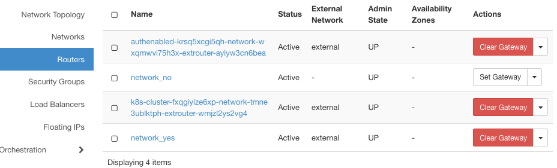

.. Kubernetes documentation master file, created by
   sphinx-quickstart on Sat Dec  4 15:26:27 2021.

.. meta::
   :description: How to autoscale Kubernetes Cluster 
   :keywords: Cloudferro, OpenStack, Magnum, Kubernetes, cluster, nodegroups, Kubernetes nodegroups, creating nodegroups

How to Create a Router on Cloudferro OpenStack Magnum
=====================================================

Written by `Dusko Savic <https://duskosavic.com>`_.

What We Are Going To Cover
--------------------------

 * List routers in the system 

 * Create a router 

 * Add ports

both with the Horizon Interface and with using the CLI. 

Prerequisites
-------------

No. 1 **Hosting**

You need a Cloudferro hosting account with `Horizon interface <https://horizon.cloudferro.com>`_.

No. 2 **Creating clusters with CLI**

The article `How To Use Command Line Interface for Kubernetes Clusters On Cloudferro OpenStack Magnum <../article_04>`_ will introduce you to the basic patterns of using the command line interface. 

No. 3 **Connect openstack client to the cloud**

Prepare **openstack** and **magnum** clients by executing *Step 2 Connect OpenStack and Magnum Clients to Horizon Cloud* from article `How To Install OpenStack and Magnum Clients for Command Line Interface to Cloudferro Horizon <../article_03>`_. 

No. 4 **Check available quotas**

Before creating additional networks, routers and ports, check the state of the resources with Horizon commands **Computer** => **Overview**.

No. 5 **Create and Manage Networks**

In article `How To Create and Manage Networks on Cloudferro OpenStack Magnum <./article_12>`_ you will learn the key aspects of working with networks. 

Step 1 List Routers Existing in the System
------------------------------------------

In this step, you are going to list the existing routers to gain orientation for future.
 
Network called *external* is the only network currently in the system that can connect to the outside world. 

Fetch the list of routers using **Network** => **Routers**:

There are two routers in the list. Judging by their names, they were created as a byproduct of automatic creation of Kubernetes clusters called *authenabled* and *k8s-cluster*. The presence of words *network* and *extrouter* in their names leads us to believe that these routers are attached to the external world via *external*. 

Use commands **Network** => **Network Topology** => **Normal** to verify it graphically. There's two routers only, both attached to *external* network:

Step 2 Create a Router Using Horizon Interface
----------------------------------------------

In this step, you are going to define a new router, attached to the *external* network, to gain access to the outside world. 

Click on button **+ Create Router** and fill in the data in the next window:

For **External Network**, you can immediately select *external* as the destination, or postpone it for later. To see the difference, create two routers, one called *network_no* in which you immediately click on **Create Router** button and the other, call it *network_yes*, in which you first select *external* network and then create the router. 

Visually:

Three routers are attached to something -- only the *network_no* router is not attached to anything. 

Listing the routers yields this view:

The difference is that *network_no* has **Set Gateway** button active. Click on it to get another chance of defining the external network. 

Conversely, clicking on red button **Clear Gateway** may be useful if you wanted to switch router to another network. 

In this step, you have connected the new router to the outside world, via an *external* network. 

Step 3 Adding Interfaces to the Router
--------------------------------------

In this step, you are going to connect your new router to the one of the existing networks. 

Click on router name in the **Network** => **Routers** list to get access to command *Interfaces* in tabs.  

Click on **+ Add Interface**.

Window **Add Interface** appears. List **Subnet** will yield all of the subnets in the system:

In field **Ip Address**, you select the exact address in the subnet to which the router will be connected. 

If left blank, the gateways's IP address of the selected subnet will be used. The range of addresses in the chosen subnet is from **192.168.2.0** to **192.168.2.255**, so the first address taken for the gateway is **192.168.2.1** and the actual range of usable addresses starts at **192.168.2.2**. Submitting **192.168.2.3** is well within that range so it was accepted into the system.

Confirm this visually, by using **Network Topology** => **Normal**:

Router *network_yes* is connected both to *external* and to *net1* networks. 

Step 4 Create Router with Command Line Interface
------------------------------------------------

In this step, you are going to create a new router using commands of type **openstack router**. First, here is a list of existing routers:

.. code::

    openstack router list 

Create a new router *router1* with this command:

.. code::

   openstack router create router1 --max-width 80

These are the data for *router1*:

The **id** value of **1f10d0af-27d6-4af7-8c9d-44a719809aad** is important as it will be used in further commands. 

Step 5 Link Router to the *external* Network
--------------------------------------------

In this step you will link router with the above **id** to the *external* network:

.. code::

   openstack router set 1f10d0af-27d6-4af7-8c9d-44a719809aad 
      --external-gateway external

It is more precise to use the value of **id** than the name of the router; it may well be that there are two or more routers with the same name if you have executed several **router create** commands while testing. 

Step 6 Link Router to the Subnet
--------------------------------

In this step you are going to link the router to the subnet, with the following command:

.. code::

   openstack router add subnet 1f10d0af-27d6-4af7-8c9d-44a719809aad subnet1

A glance at the **Network Topology** option shows that *router1* has been connected to *external* network on the "left" side and to the subnet on the "right" side. 

The exact address of the subnet is **192.168.2.1**.

See that from the CLI as well:

.. code::

   openstack router show 1f10d0af-27d6-4af7-8c9d-44a719809aad

Step 7 Create Ports with CLI
----------------------------

In this step, you will create ports with and without given IP address. 

The command to create port *port2* on the existing network *net1*:

.. code::

   openstack port create port2 --network net1

And this is the command to create *port1* with the IP address of **192.168.2.41**, on network *net1*:

.. code::

  openstack port create 
      --network net1 
      --fixed-ip subnet=subnet1,ip-address=192.168.2.41 port1
      --max-width 80

List the ports:

.. code::
   
   openstack port list --max-width 80

The output of these commands is too voluminous to show here. 

What To Do Next
---------------

On a platform such as OpenStack, you will most likely generate Kubernetes clusters automatically, meaning the the networks, routers, ports etc. will be harmonized from the start. It is further down the road, when you have a working cluster and have to change it, that the manual operations described in this article become crucial. 
