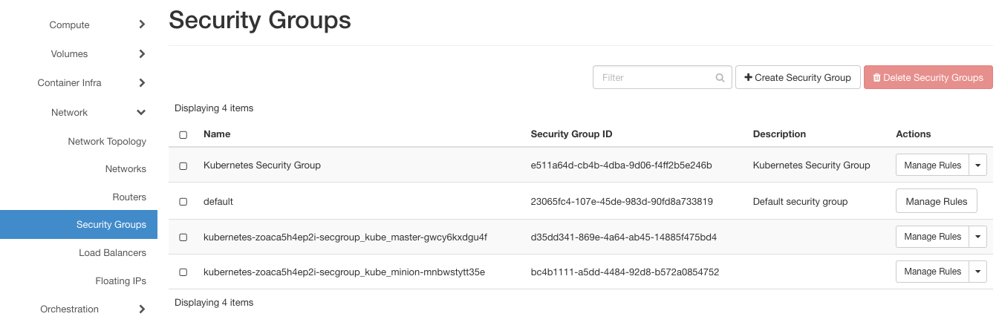
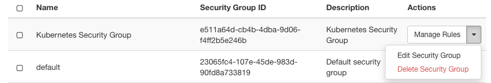
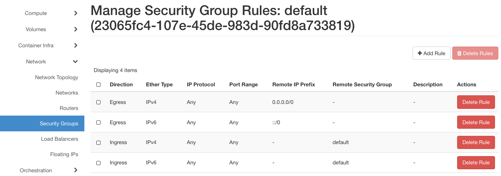
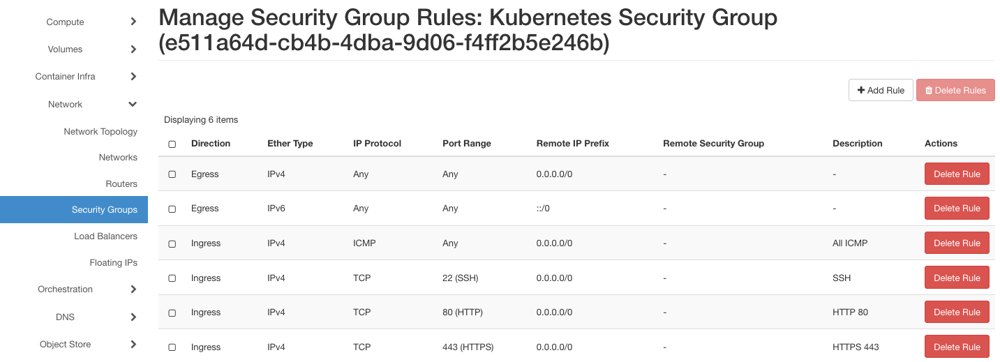
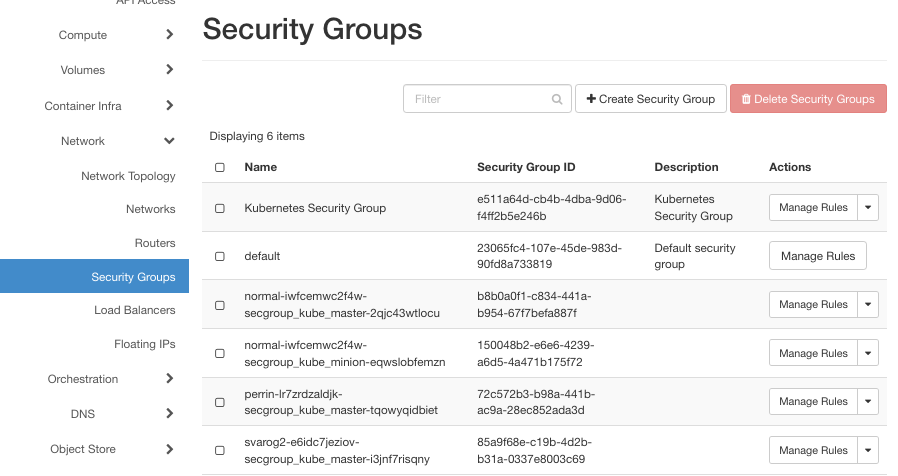
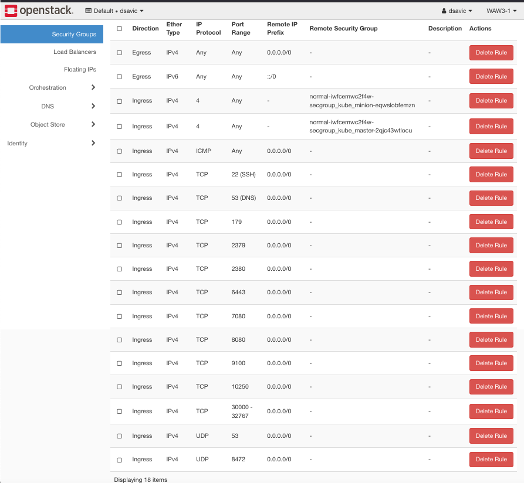
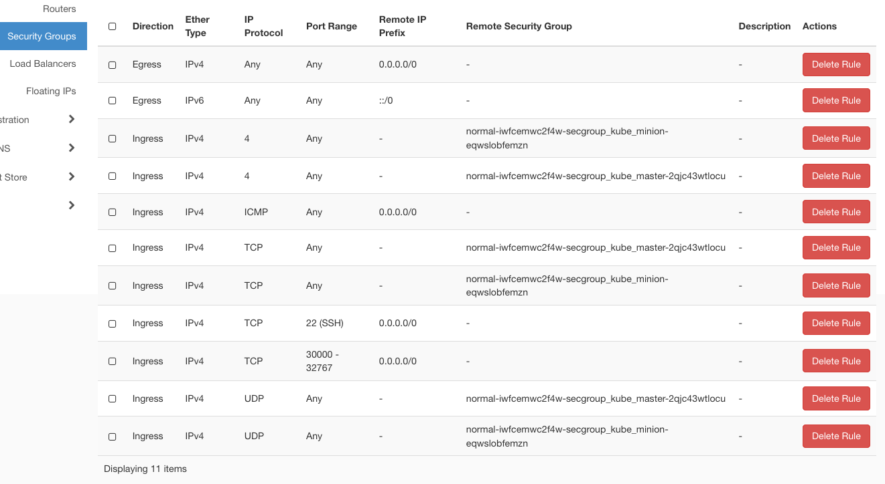
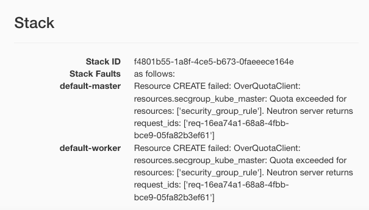
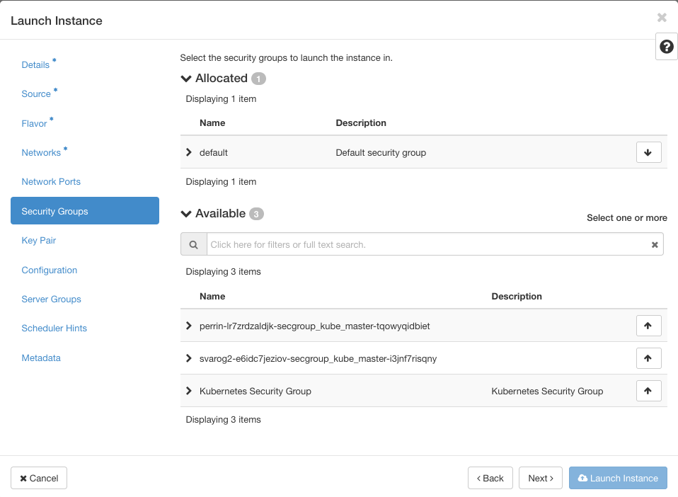

.. Kubernetes documentation master file, created by
   sphinx-quickstart on Sat Dec  4 15:26:27 2021.
   
:
   :description: What security rules will protect your network? 
   :keywords: security groups, security rules, Cloudferro, OpenStack, Magnum, Kubernetes, cluster, network

How to Use Security Groups to Tighten Security Using Cloudferro OpenStack Magnum
================================================================================

Written by `Dusko Savic <https://duskosavic.com>`_.

What We Are Going To Cover
--------------------------

 * Definition of group security rules

 * The *default* group security rule

 * Give examples of security rules for instances

 * Show security rules for master nodes in a new Kubernetes Cluster

 * Ditto for the worker nodes

 * Show errors when quotas for security groups and rules are full

Prerequisites
-------------

**Hosting**

You need a Cloudferro hosting account with `Horizon interface <https://horizon.cloudferro.com>`_.

**Creating a New Kubernetes Cluster**

Article `How to Create a Kubernetes Cluster Using Cloudferro OpenStack Magnum <../article_01/index.html>`_, describes how to create a new Kubernetes cluster starting with the default cluster template called *k8s-stable-1.21.5-cf1*. 

**Working with Security Groups in Horizon**

Article `How to use security groups in Horizon? <https://creodias.eu/-/how-to-use-security-groups-in-horizon-?inheritRedirect=true&redirect=%2Ffaq-security>`_ shows basic techniques for creating and adding security group rules. 

What are Security Group Rules
-----------------------------

Group security rules are a group of security rules for network access, tied to one particular resource in the system. They act as a firewall for one instance. Magnum supplies a *default* security group which is automatically used if no security group is specified.

Traffic that comes to the instance is called *ingress* while the traffic that goes from the instance is called *egress*. Ingress describes inbound traffic, egress describes outbound traffic to and from the resource.  

The main goal of security rules and groups is to limit the type of traffic that an instance can send or receive. A security rule takes port number as its input and defines whether it is open or closed. 

List Existing Group Security Rules
-----------------------------------------

Commands **Network** and then **Security Groups** show the list:

You cannot delete the *default* security group and it has only one option, **Manage Rules**. Other groups will have also the option to delete the group:

**Manage Rules** for the Default Security group
-----------------------------------------------

Click on button **Manage Rules** to the right of the screen to see the rules for the group:

The rules come in pairs, one rule for IPv4 and the other for IPv6 types of addresses. If you know that Ipv6 addresses are not going to be available to your users in the near future, you may skip them. 

Example Security Group For Internet Traffic
-------------------------------------------

Security group *Kubernetes Security Group* extends the *default* security group by adding four new protocols:

 * pings (ICMP protocol),

 * port 22 for FTP traffic, 

 * port 80 for HTTP traffic,

 * port 443 for HTTPS traffic. 

If this instance were exposed to the Internet, file transport apps such as FileZilla and browsers such as Firefox or Chrome, would not be able to access it. 

Security Rules For Master Nodes in Kubernetes Clusters
------------------------------------------------------

Adding a new cluster boils down to adding new instances for master and minion instances. If you add a cluster called *Normal*, this is what you would see in the list of security rules:

Click on button **Manage Rules** on the right to see what was added for the master node:

A total of 18 rules, covering the most vulnerable ports. It is out of scope of this article to list them all, but we shall illustrate the problems that may arise by taking port 179 as an example. 

Port 179 is used for protocols TCP, UDP, and SCTP, the service that uses them is BGP -- Border Gateway Protocol and the threat is that there exist certain types of hardware switches that allow remote attackers to bypass protection and use port 179 as the source port of a packet. 

Security Rules For Worker Nodes in Kubernetes Clusters
------------------------------------------------------

.. note::

   Worker nodes used to be called *minions* in earlier versions of Kubernetes, so that is still reflected in file names such as ... *secgroup_kube_minion* ... 

There are 11 rules for worker nodes:

Security Groups and Quotas
--------------------------

Each time you create a cluster, several system resources are claimed from the system quota and allocated to the parts of the cluster. Creating a cluster uses 11 security rules per worker node and 18 rules per master node. If you have 10 worker nodes, that will be 110 rules, which may be over the system quota and the creation of cluster will fail.

The same will happen if you experiment with creation of several clusters in a row -- the quota may be filled up and the cluster creation fails. Here is the message that you would see when you click on the cluster name in **Container Infra** and **Cluster**:

For that reason, be sure to delete all clusters that have failed to create. Depending on the state in which creation failed, you may need to manually delete ports, subnets, instances and networks in that order -- from smaller to the larger. 

Insertion of Security Groups While Creating a New Instance
----------------------------------------------------------

The proper place to add security groups is when creating a new instance so it is essential to have the security groups created beforehand. 

Start the process of creation of an instance by clicking on **Compute**, then **Instances** and then **Launch Instance**. The sixth screen from the top is for **Security Groups**:

The *default* security group will be applied if you do not select another group. Click on the arrow to the right of the group that you want to install and that name will become allocated to the instance. 

What To Do Next
---------------

Before creating a network, instance or a cluster, ask yourself:

  **"What will happen if an attacker has access at this point of the system?"**

then adjust the security rules accordingly. 

.. toctree::
   :maxdepth: 3
   :caption: Contents:

    
