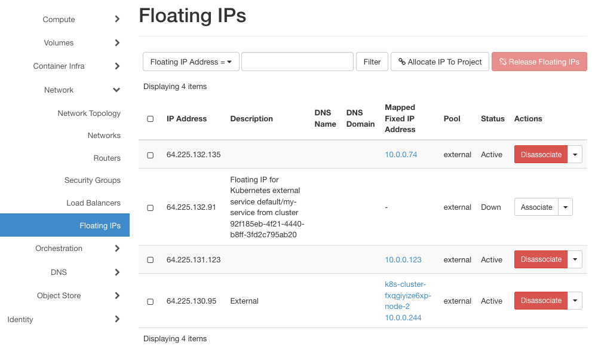
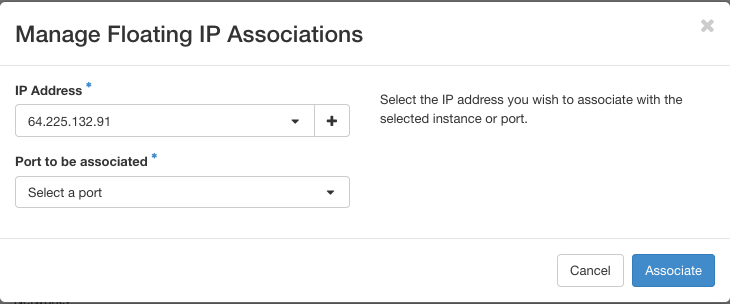
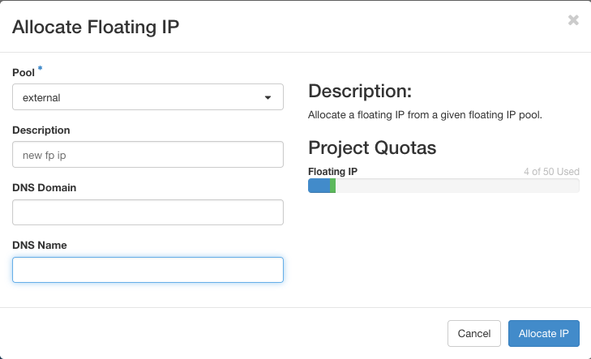
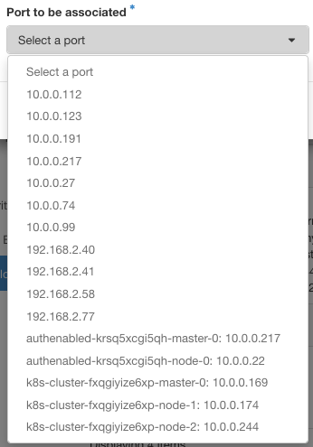
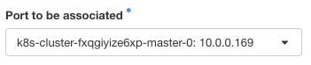
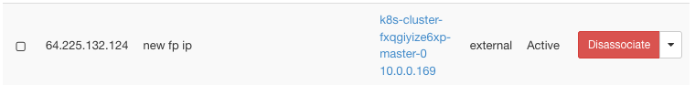
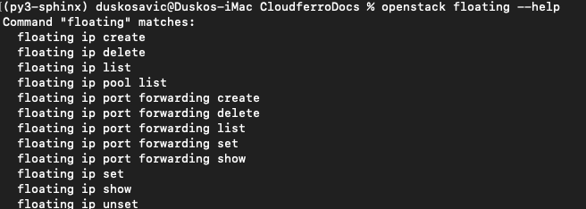
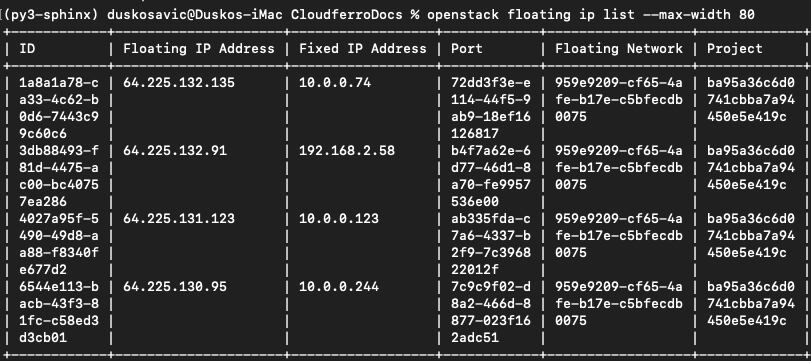
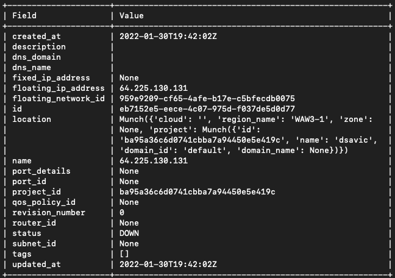

.. Kubernetes documentation master file, created by
   sphinx-quickstart on Sat Dec  4 15:26:27 2021.

.. meta::
   :description: How to autoscale Kubernetes Cluster 
   :keywords: Cloudferro, OpenStack, Magnum, Kubernetes, cluster, nodegroups, Kubernetes nodegroups, creating nodegroups

How to Create and Return a Floating IP Address on Cloudferro OpenStack Magnum
=============================================================================

Written by `Dusko Savic <https://duskosavic.com>`_.

A floating IP address is a public, routable IP address that can be temporarily assigned to one or more instances or cluster elements. It may not be assigned automatically during initialization but the project owner -- manually or automatically through software -- can activate it when the need arises. 

Cluster elements have internal fixed network addresses and the floating IP address acts like a bridge between the outside DNS address and that "inner" fixed address. The end result is that certain elements of the cluster gain direct access to the outside world. 

However, floating IP address can be released just as easily as it was attached and then it returns to the pool of floating IP addresses. Next time a floating IP address is taken from the pool, that may be some another address and the continuity is not guaranteed. 

The user that has the hold of the particular address can use it, remove it and assign to some other element at any time. The transfer of destination is instantaneous. A typical scenario would be testing. Suppose you were testing one pod in the cluster, when you were done, you would change its floating IP address to point to the finished version, without the end user ever noticing. 

Another useful scenario is helping with load balancing, or recovering from failures, or switching over to a new version of the software. 

Added security is another advantage of using floating IP addresses as they an hide the real IP address of the server. 

What We Are Going To Cover
--------------------------

 * How to list existing floating IP addresses

 * How to add a new floating IP address with Horizon interface

 * How to select a port for the floating IP address

 * How to release it through Horizon interface

 * How to create a floating IP address with the CLI

 * How to release the floating IP address with CLI

Prerequisites
-------------

No. 1 **Hosting**

You need a Cloudferro hosting account with `Horizon interface <https://horizon.cloudferro.com>`_.

No. 2 **Creating clusters with CLI**

The article `How To Use Command Line Interface for Kubernetes Clusters On Cloudferro OpenStack Magnum <../article_04>`_ will introduce you to creation of clusters using a command line interface. 

No. 3 **Connect openstack client to the cloud**

Prepare **openstack** and **magnum** clients by executing *Step 2 Connect OpenStack and Magnum Clients to Horizon Cloud* from article `How To Install OpenStack and Magnum Clients for Command Line Interface to Cloudferro Horizon <../article_03>`_. 

No. 4 **Learn about Floating IP Addresses and Kubernetes Clusters**

*Step 3 Pros and Cons* in article `How To Create Floating IP for Servers on Cloudferro OpenStack Magnum <../article_07>`_ will introduce you to the importance of floating IP addresses in relation to Kubernetes clusters, as well as in other types of servers.

Step 1 Analysis of the Existing Floating IP Addresses
-----------------------------------------------------

In this step, you are going to list and analyze available floating IP addresses in the system. 

To list, use commands **Network** => **Floating IPs**:

Click on button **Associate** for address **64.225.132.91** and window **Manage Floating IP Associations** will appear on screen:

Step 2 Add a New Floating IP Address
------------------------------------

In this step, you will obtain new IP address. 

Click on plus button to the right of field **IP Address** and show window **Allocate Floating IP**:

The floating IP addresses are allocated from a given pool of addresses, which is shown on the right side of that window. 

Click on blue button **Allocate IP** to create a floating IP address, in this case, it is **64.225.132.124**. It will be written back into the previous window.

Step 3 Select Port
------------------

In this step, you select the port for the new floating IP address. 

The field **Port to be associated** offers a large selection of ports:

There are various addresses to choose from, some are "standalone" while some belong to existing clusters *authenabled* and *k8s-cluster*.

Click on button **Associate** and select port to be associated as follows:

As a result, the new floating IP will be tied to the *k8s-cluster*:

Step 4 Release Floating IP Through Horizon Interface
----------------------------------------------------

In this step you will release floating IP **64.225.132.124**: check it and then click on red button **Disassociate**:

A confirmation window appers; confirm it again and that IP address will be returned to the  pool. 

Step 5 Create Floating IP Address Using the CLI
-----------------------------------------------

In this step, you will create a new floating IP address using the command line interface. The general command is **openstack floating ip**. To learn about its parameters, add **--help** at the end:

First list the existing floating IPs:

Then create a new floating ip with the following command:

.. code::

   openstack floating ip create external --max-width 80

Note its **id**, which is **eb7152e5-eece-4c07-975d-f037de5d0d77**. 

Step 6 Release Floating IP Address Using the CLI
------------------------------------------------

In this step, you will delete the existing floating IP, using the **id** that was just created: 

.. code::

   openstack floating ip delete eb7152e5-eece-4c07-975d-f037de5d0d77

The deleted IP address will return to the pool of floating IP addresses and be available in the future. 

What To Do Next
---------------

Article `How To Create Floating IP for Servers on Cloudferro OpenStack Magnum <../article_07>`_ shows how to use parameter **--floating-ip-enabled** to create a cluster with preinstalled floating IP address.

  
   

   

