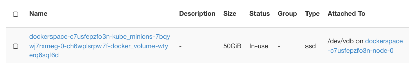
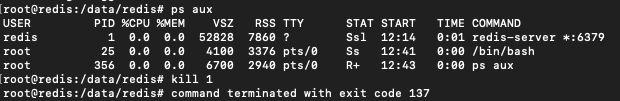
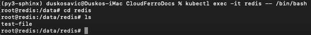

.. Kubernetes documentation master file, created by
   sphinx-quickstart on Sat Dec  4 15:26:27 2021.

.. meta::
   :description: Volume-based vs Ephemeral-based Storage Kubernetes Cluster 
   :keywords: Cloudferro, OpenStack, Magnum, Kubernetes, cluster, nodegroups, Kubernetes nodegroups, creating nodegroups

Volume-based vs Ephemeral-based Storage for Kubernetes Clusters on Cloudferro OpenStack Magnum
==============================================================================================

Written by `Dusko Savic <https://duskosavic.com>`_.

Containers in Kubernetes store files on-disk and if the container crashes, the data will be lost. A new container can replace the old one but the data will not survive. Another problem that appears is when containers running in a pod need to share files. 

That is why Kubernetes has another type of file storage, called *volumes*. They can be either *persistent* or *ephemeral*, as measured against the lifetime of a pod:

 * Ephemeral volumes are deleted when the pod is deleted, while

 * Persistent volumes continue to exist even if the pod it is attached to does not exist any more.   

The concept of volumes was first popularised by Docker, where it was a directory on disk, or within a container. In CloudFerro OpenStack hosting, the default docker storage is configured to use ephemeral disk of the instance. This can be changed by specifying docker volume size during cluster creation, symbolically like this (see below for the full command to generate a new cluster using **--docker-volume-size**):

.. code:: 

   openstack coe cluster create --docker-volume-size 50

This means that a persistent volume of 50 GB will be created and attached to the pod. Using **--docker-volume-size** is a way to both reserve the space and declare that the storage will be persistent.

What We Are Going To Cover
--------------------------

 * How to create a cluster when **--docker-volume-size** is used

 * How to create a pod manifest with *emptyDir* as volume

 * How to create a pod with that manifest

 * How to execute *bash* commands in the container

 * How to save a file into persistent storage

 * How to demonstrate that the attached volume is persistent

Prerequisites
-------------

1 **Hosting**

You need a Cloudferro hosting account with `Horizon interface <https://horizon.cloudferro.com>`_.

2 **Creating clusters with CLI**

The article `How To Use Command Line Interface for Kubernetes Clusters On Cloudferro OpenStack Magnum <../article_04>`_ will introduce you to creation of clusters using a command line interface. 

3 **Connect openstack client to the cloud**

Prepare **openstack** and **magnum** clients by executing *Step 2 Connect OpenStack and Magnum Clients to Horizon Cloud* from article `How To Install OpenStack and Magnum Clients for Command Line Interface to Cloudferro Horizon <../article_03>`_. 

4 **Check available quotas**

Before creating additional cluster check the state of the resources with Horizon commands **Computer** => **Overview**.

5 **Private and public keys**

An SSH key-pair created in OpenStack dashboard. To create it, follow this article  `How to create key-pair in OpenStack dashboard? <https://creodias.eu/-/a-9-15>`_. You will have created keypair called *sshkey* and you will be able to use it for this tutorial as well. 

6 **Types of Volumes**

Types of volumes are described in the `official Kubernetes documentation <https://kubernetes.io/docs/concepts/storage/volumes/>`_ .

Step 1 - Create Cluster Using **--docker-volume-size**
------------------------------------------------------

You are going to create a new cluster called *dockerspace* that will use parameter **--docker-volume-size** using the following command:

.. code::

   openstack coe cluster create dockerspace 
     --cluster-template k8s-stable-1.21.5-cf1
     --keypair sshkey 
     --master-count 1 
     --node-count 2 
     --docker-volume-size 50 
     --master-flavor eo1.large 
     --flavor eo2.large 

After a few minutes the new cluster **dockerspace** will be created. 

Click on **Container Infra** => **Clusters** to show the three clusters in the system: *authenabled*, *k8s-cluster* and *dockerspace*.

Here are their instances (after clicking on **Compute** => **Instances**):

They will have at least two instances each, one for the master and one for the worker node. *dockerspace* has three instances as it has two worker nodes, created with flavor *eo2.large*.

So far so good, nothing out of the ordinary. Click on **Volumes** => **Volumes** to show the list of volumes:

.. image:: volumes.png

If **--docker-volume-size** is not turned on, only instances with *etcd-volume* in their names would appear here, as is the case for clusters *authenabled* and *k8s-cluster*. If it is turned on, additional volumes would appear, one for each node. *dockerspace* will, therefore, have one instance for master and two instances for worker nodes. 

Note the column **Attached**. All nodes for *dockerspace* use **/dev/vdb** for storage, which is a fact that will be important later on. 

As specified during creation, *docker-volumes* have size of 50 GB each. 

In this step, you have created a new cluster with docker storage turned on and then you verified that the main difference lies in creation of volumes for the cluster. 

Step 2 - Create Pod Manifest
----------------------------

To create a pod, you need to use a file in *yaml* format that defines the parameters of the pod. Use command

.. code::

   nano redis.yaml

to create file called *redis.yaml* and copy the following rows into it:

.. code::

   apiVersion: v1
   kind: Pod
   metadata:
     name: redis
   spec:
     containers:
     - name: redis
       image: redis
       volumeMounts:
       - name: redis-storage
        mountPath: /data/redis
     volumes:
     - name: redis-storage
       emptyDir: {}

This is how it will look like in the terminal:

.. image:: nano_redis_yaml.png

You are creating a *Pod*, its name will be *redis*, and it will occupy one container also called *redis*. The content of that container will be an image called **redis**.

Redis is a well known database and its image is prepared in advance so can be pulled off directly from a repository. If you were implementing your own application, the best way would be to release it through Docker and pull from its repository.

New volume is called *redis-storage* and its directory will be */data/redis*. The name of the volume will again be *redis-storage* and it will be of type *emptyDir*. 

An *emptyDir* volume is initially empty and is first created when a Pod is assigned to a node. It will exist as long as that Pod is running there and if the Pod is removed, the related data in *emptyDir* will be deleted permanently. However, the data in an *emptyDir* volume is safe across container crashes. 

Besides *emptyDir*, about a dozen other volume types could have been used here: *awsElasticBlockStore*, *azureDisk*, *cinder* and so on.  

In this step, you have prepared pod manifest with which you will create the pod in the next step.

Step 3 - Create a Pod on Node **0** of *dockerspace*
----------------------------------------------------

In this step you will create a new pod on node **0** of *dockerspace* cluster. 

First see what pods are available in the cluster:

.. code::

   kubectl get pods

This may produce error line such as this one:

.. code::

   The connection to the server localhost:8080 was refused - did you specify the right host or port?

That will happen in case you did not set up the kubectl parameters as specified in Prerequisites No. 3. You will now set it up for access to *dockerstate*:

.. code::

   mkdir dockerspacedir

   openstack coe cluster config
   --dir dockerspacedir
   --force
   --output-certs
   dockerspace

First create a new directory, *dockerspacedir*, where the config file for access to the cluster will reside, then execute the **cluster config** command. The output will be a line like this:

.. code::
   
   export KUBECONFIG=/Users/duskosavic/CloudferroDocs/dockerspacedir/config

Copy it and enter again as the command in terminal. That will give **kubectl** app access to the cluster. Create the pod with this command:

.. code::

   kubectl apply -f redis.yaml

It will read parameters in *redis.yaml* file and send them to the cluster. 

Here is the command to access all pods, if any:

.. code::

   kubectl get pods
   
   NAME    READY   STATUS              RESTARTS   AGE
   redis   0/1     ContainerCreating   0          7s

Repeat the command after a few seconds and see the difference:

.. code::

   kubectl get pods

   NAME    READY   STATUS    RESTARTS   AGE
   redis   1/1     Running   0          81s

In this step, you have created a new pod on cluster *dockerspace* and it is running. 

In the next step, you will enter the container and start issuing commands just like you would in any other Linux environment.

Step 4 - Executing *bash* Commands in the Container
----------------------------------------------------

In this step, you will start **bash** shell in the container, which in Linux is equivalent to start running the operating system: 

.. code::

   kubectl exec -it redis -- /bin/bash
   
The following listing is a reply:

.. code::

   root@redis:/data# df -h
   Filesystem      Size  Used Avail Use% Mounted on
   overlay          50G  1.4G   49G   3% /
   tmpfs            64M     0   64M   0% /dev
   tmpfs           3.9G     0  3.9G   0% /sys/fs/cgroup
   /dev/vdb         50G  1.4G   49G   3% /data
   /dev/vda4        32G  4.6G   27G  15% /etc/hosts
   shm              64M     0   64M   0% /dev/shm
   tmpfs           3.9G   16K  3.9G   1% /run/secrets/kubernetes.io/serviceaccount
   tmpfs           3.9G     0  3.9G   0% /proc/acpi
   tmpfs           3.9G     0  3.9G   0% /proc/scsi
   tmpfs           3.9G     0  3.9G   0% /sys/firmware

This is what it would look like in the terminal:

Note that the prompt changed to 

.. code::

   root@redis:/data# 

which means you are now issuing commands within the container itself. The pod operates as Fedora 33 and you can use **df** to see the volumes and their sizes. Command

.. code::

   df -h

lists sizes of files and directories in a human fashion (the usual meaning of parameter **-h** would be *Help*, while here it is short for *Human*). 

In this step, you have activated the container operating system. 

Step 5 - Saving a File Into Persistent Storage
----------------------------------------------

In this step you are going to test the longevity of files on persistent storage. You will first 

 * save a file into the */data/redis* directory, then 

 * kill the Redis process, which in turn will 

 * kill the container; finally, you will

 * re-enter the pod, 

where you will find the file intact.

Note that **dev/vdb** has 50 GB in size in the above listing and connect it to the column **Attached To** in the **Volumes** => **Volumes** listing:

In its own turn, it is tied to an instance:

That instance is injected into the container and -- being an independent instance -- acts as persistent storage to the pod.

Create a file on the *redis* container:

.. code::

   cd /data/redis/
   echo Hello > test-file

Install software to see the **PID** number of *Redis* process in the container 

.. code::

   apt-get update
   apt-get install procps
   ps aux

These are the running processes:

Take the **PID** number for *Redis* process (here it is **1**), and eliminate it with command

.. code::

   kill 1

That will first kill the container and then exit its command line. 

In this step, you have created a file and killed the container that contains the file. This sets up the ground for testing whether the files survive container crash.

Step 6 - Check the File Saved in Previous Step
----------------------------------------------

In this step, you will find out whether the file *test-file* is still existing. 

Enter the pod again, activate its **bash** shell and see whether the file has survived:

.. code::

   kubectl exec -it redis -- /bin/bash
   cd redis
   ls

   test-file

Yes, the file *test-file* is still there. The persistent storage for the pod contains it in path */data/redis*:

In this step, you have entered the pod again and found out that the file has survived intact. That was expected, as volumes of type *emptyDir* will survive container crashes as long as the pod is existing. 

What To Do Next
---------------

*emptyDir* survives container crashes but will disappear when the pod disappears. Other volume types may survive loss of pods better. For instance:

 * *awsElasticBlockStore* will have the volume unmounted when the pod is gone; being unmounted and not destroyed, it will persist the data it is containing. This type of volume can have pre-populated data and can share the data among the pods. 

 * *cephfs* can also have pre-populated data and share them among the pods, but can additionally also be mounted by multiple writers at the same time.

Other constraints may also apply. Some of those volume types will require their own servers to be activated first, or that all nodes on which Pods are running need be of the same type and so on. Prerequisite No. 6. will list all types of volumes for Kubernetes clusters so study it and apply to your own Kubernetes apps.

